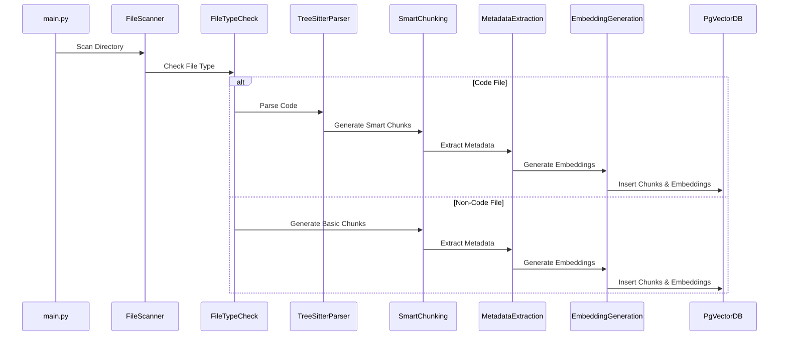

# 프로젝트 구조 및 개요

## 개요

이 프로젝트는 TypeScript로 작성된 Continue 프로젝트의 코드 청킹 시스템을 Python으로 포팅한 것입니다. Tree-sitter 파서를 활용하여 Java, JavaScript, Python 등의 소스 코드를 구조적으로 청킹하고, PostgreSQL과 pgvector를 사용하여 벡터 임베딩 및 유사도 검색을 수행합니다. 또한, JSONB를 통해 풍부한 코드 메타데이터를 저장하고, 파일 간의 관계(참조 관계, 상속 관계, 의존 관계 등)를 자동 분석하는 기능을 제공합니다.

## 프로젝트 구조

### 디렉토리 구성

프로젝트는 다음과 같은 디렉토리 구조를 가지고 있습니다.

- `core/`: 핵심 로직을 담고 있는 디렉토리입니다.
    - `embeddings/`: 텍스트 임베딩 관련 코드가 있습니다. (`embeddings_provider.py`, `simple_embeddings.py`)
    - `index.py`: 코드 청킹 및 검색을 위한 핵심 인터페이스 및 데이터 구조를 정의합니다.
    - `indexing/`: 코드 청킹 및 인덱싱 관련 코드가 있습니다.
        - `chunk/`: 청크 생성 및 관리에 관련된 코드가 있습니다. (`basic.py`, `code.py`, `chunk.py`, `metadata.py`)
        - `pgvector_index.py`: PostgreSQL과 pgvector를 사용하여 인덱스를 관리하는 클래스를 포함합니다.
    - `llm/`: 언어 모델 관련 유틸리티, 특히 토큰 수 계산을 위한 코드가 있습니다. (`count_tokens.py`)
    - `util/`: 유틸리티 함수들을 포함합니다.
        - `tree_sitter.py`: Tree-sitter 파서 사용을 위한 유틸리티 함수를 제공합니다.
        - `uri.py`: URI 관련 유틸리티 함수를 제공합니다.
- `vendor/`: Tree-sitter 파서의 소스 코드를 저장하는 디렉토리입니다. `setup_vendor.py` 스크립트를 통해 다운로드됩니다.
    - `tree-sitter-python/`, `tree-sitter-javascript/`, `tree-sitter-java/`: 각 언어별 Tree-sitter 파서 소스 코드를 포함합니다.
- `test_files/`: 테스트에 사용되는 코드 파일들을 포함합니다.
- `build_parsers.py`: Tree-sitter 파서를 컴파일하는 스크립트입니다.
- `main.py`: 메인 실행 파일이며, 디렉토리 인덱싱을 수행합니다.
- `setup_vendor.py`: Tree-sitter 파서 소스 코드를 다운로드하는 스크립트입니다.
- `requirements.txt`: 프로젝트 의존성 목록을 포함합니다.
- `db_test.py`: 데이터베이스 연결 및 쿼리를 테스트하는 스크립트입니다.
- `drop_table.py`: 데이터베이스 테이블을 삭제하는 스크립트입니다.

### 주요 컴포넌트

- **Tree-sitter 파서**: C++로 작성된 Tree-sitter 파서를 Python에서 사용하여 소스 코드를 파싱합니다. (`vendor/tree-sitter-*`)
- **청크 생성 모듈**: `core/indexing/chunk` 디렉토리에 위치하며, 소스 코드를 의미 있는 청크로 분할하는 역할을 합니다.
    - `basic.py`: 기본적인 청킹 로직을 구현합니다.
    - `code.py`: Tree-sitter 파싱 결과를 기반으로 코드 구조에 따른 스마트 청킹을 수행합니다.
    - `chunk.py`: 청크 관련 데이터 구조를 정의하고, 청킹 과정을 조정합니다.
- **벡터 인덱스**: `core/indexing/pgvector_index.py`는 PostgreSQL과 pgvector를 사용하여 코드 청크의 임베딩 벡터를 저장하고 검색하는 기능을 제공합니다. LanceDB를 사용하는 `lance_db_index.py`도 존재합니다.
- **임베딩 프로바이더**: `core/embeddings/embeddings_provider.py`는 텍스트 임베딩 모델을 관리하고, 코드 청크의 텍스트를 벡터로 변환하는 역할을 합니다.
- **메인 실행 파일**: `main.py`는 지정된 디렉토리의 코드 파일을 순회하며, 청킹 및 인덱싱 작업을 수행합니다.

### 중요 파일

- `main.py`: 코드 인덱싱을 시작하는 진입점입니다. 지정된 디렉토리의 파일을 스캔하고, 각 파일에 대해 청킹, 임베딩 생성, 데이터베이스 저장 등의 작업을 수행합니다.
- `core/indexing/pgvector_index.py`: pgvector를 사용하여 코드 청크를 저장하고 검색하는 핵심 로직을 포함합니다.
- `core/indexing/chunk/code.py`: Tree-sitter 파싱 결과를 사용하여 코드 구조에 맞게 스마트 청킹을 수행하는 로직을 구현합니다.
- `setup_vendor.py`: Tree-sitter 파서를 다운로드하는 스크립트입니다.
- `build_parsers.py`: 다운로드된 Tree-sitter 파서를 컴파일하여 `.so` 파일을 생성합니다.

## 주요 기능

### 기능 1: Tree-sitter 기반 파싱

- 설명: 소스 코드를 구조적으로 파싱하기 위해 Tree-sitter 파서를 사용합니다. 이를 통해 정확하고 효율적인 코드 청킹이 가능합니다.
- 구현: `core/util/tree_sitter.py`는 Tree-sitter 파서를 초기화하고 사용하는 유틸리티 함수를 제공합니다. `core/indexing/chunk/code.py`는 파싱된 AST 노드를 기반으로 청크를 생성합니다.
- 관련 파일: `core/util/tree_sitter.py`, `core/indexing/chunk/code.py`, `vendor/tree-sitter-*`

### 기능 2: 스마트 청킹

- 설명: AST 노드별로 구조적인 청킹을 수행하여 코드의 의미를 보존하고 검색 정확도를 높입니다.
- 구현: `core/indexing/chunk/code.py`는 Tree-sitter 파싱 결과를 순회하며, 클래스, 함수, 메서드 등의 코드 구조를 기반으로 청크를 생성합니다.
- 관련 파일: `core/indexing/chunk/code.py`

### 기능 3: 다중 언어 지원

- 설명: Java, JavaScript, Python 등 다양한 프로그래밍 언어를 지원합니다.
- 구현: 각 언어별 Tree-sitter 파서를 사용하여 해당 언어의 문법에 맞게 코드를 파싱하고 청킹합니다.
- 관련 파일: `vendor/tree-sitter-*`, `build_parsers.py`

### 기능 4: pgvector 벡터 저장

- 설명: PostgreSQL과 pgvector 확장을 사용하여 코드 청크의 임베딩 벡터를 저장하고 유사도 검색을 수행합니다.
- 구현: `core/indexing/pgvector_index.py`는 pgvector를 사용하여 벡터 임베딩을 저장하고, 코사인 유사도를 기반으로 검색을 수행합니다.
- 관련 파일: `core/indexing/pgvector_index.py`

### 기능 5: 크로스 파일 분석

- 설명: 파일 간의 관계(참조 관계, 상속 관계, 의존 관계 등)를 분석하여 코드베이스 전체의 이해도를 높입니다.
- 구현: (현재 구현되지 않음. `CROSS_FILE_ANALYSIS.md` 파일 참조) 심볼 테이블을 구축하고, 각 파일의 심볼 정의 및 참조 정보를 분석하여 파일 간의 관계를 파악합니다.
- 관련 파일: `CROSS_FILE_ANALYSIS.md`

## 아키텍처 다이어그램

```mermaid
graph LR
A[main.py] --> B(File Scanner)
B --> C;
    C{File Type Check}
C -- Code File --> D;[Tree-sitter Parser]
C -- Non-Code File --> E;[Basic Chunking]
D --> F;[Smart Chunking]
F --> G;[Metadata Extraction]
G --> H;[Embedding Generation]
H --> I;[PgVector Database]
E --> J;[Token-based Chunking]
J --> G;
I -- Store Chunks & Embeddings -- > I;
K[User Query]  --> L;[Similarity Search]
L --> I;
I -- Retrieve Chunks --> M;[Results]
```

## 플로우 다이어그램



## 파일 구조 상세 정보

```
python_chunking/
├── CROSS_FILE_ANALYSIS.md          # 크로스 파일 분석에 대한 설명 (미구현)
├── README.md                       # 프로젝트 설명 및 사용법
├── build_parsers.py                # Tree-sitter 파서 컴파일 스크립트
├── core/
│   ├── __init__.py
│   ├── embeddings/
│   │   ├── __init__.py
│   │   ├── embeddings_provider.py  # 임베딩 모델 관리 및 제공
│   │   └── simple_embeddings.py    # 간단한 임베딩 구현 (예: 평균 벡터)
│   ├── index.py                    # 핵심 타입 정의 (PathAndCacheKey 등)
│   ├── indexing/
│   │   ├── __init__.py
│   │   ├── chunk/
│   │   │   ├── __init__.py
│   │   │   ├── basic.py            # 기본 청킹 로직
│   │   │   ├── chunk.py            # 청크 관련 데이터 구조 정의
│   │   │   ├── code.py             # 코드 기반 스마트 청킹 로직
│   │   │   └── metadata.py         # 코드 메타데이터 추출 관련 로직
│   │   ├── lance_db_index.py       # LanceDB 인덱스 (대안)
│   │   └── pgvector_index.py       # pgvector 기반 인덱스 (주요)
│   ├── llm/
│   │   └── count_tokens.py         # 토큰 수 계산 유틸리티
│   └── util/
│       ├── __init__.py
│       ├── tree_sitter.py          # Tree-sitter 유틸리티 함수
│       └── uri.py                  # URI 관련 유틸리티
├── db_test.py                    # 데이터베이스 연결 및 쿼리 테스트
├── drop_table.py                 # 데이터베이스 테이블 삭제 스크립트
├── main.py                       # 메인 실행 파일 (디렉토리 인덱싱)
├── requirements.txt              # 프로젝트 의존성 목록
├── setup_vendor.py                # Tree-sitter 파서 다운로드 스크립트
├── test_files/                   # 테스트 파일 디렉토리
│   ├── Calculator.java           # Java 테스트 파일
│   ├── Calculator.js             # JavaScript 테스트 파일
│   └── Calculator.py             # Python 테스트 파일
└── vendor/                      # Tree-sitter 파서 소스 코드
    ├── tree-sitter-java/
    │   └── ...
    ├── tree-sitter-javascript/
    │   └── ...
    └── tree-sitter-python/
        └── ...
```
