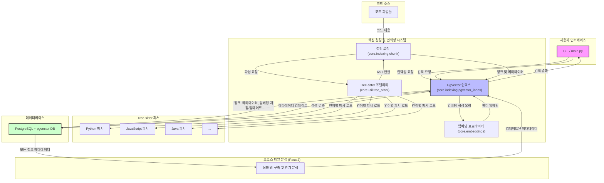
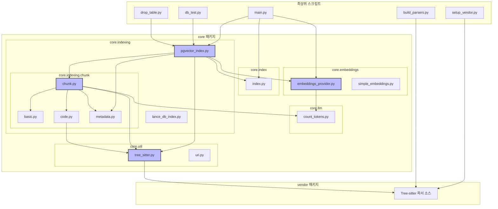
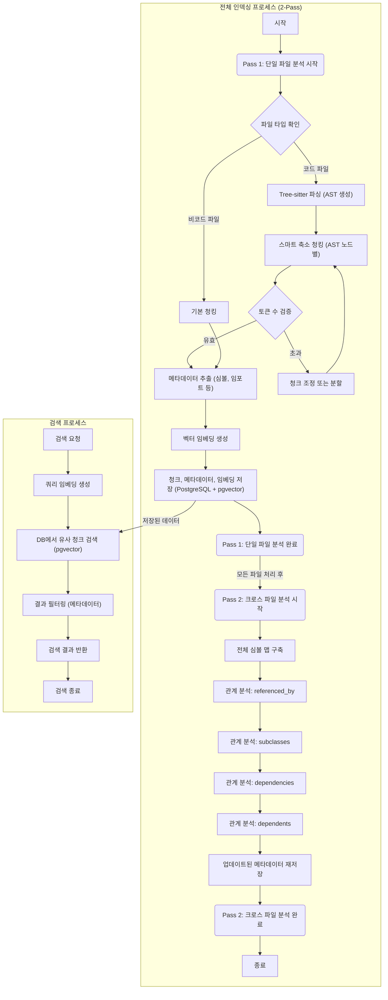

# 프로젝트 구조 및 개요

## 개요
`python_chunking` 프로젝트는 TypeScript 기반의 Continue 프로젝트의 코드 청킹 시스템을 Python으로 포팅한 것입니다. 이 시스템은 Tree-sitter를 활용하여 Java, JavaScript, Python 등 다양한 프로그래밍 언어의 소스코드를 구조적으로 분석하고 청킹합니다. 주요 기능으로는 Tree-sitter 기반의 스마트 청킹, 다중 언어 지원, PostgreSQL의 pgvector 확장을 이용한 벡터 임베딩 저장 및 유사도 검색, JSONB를 활용한 풍부한 코드 메타데이터 저장, 그리고 파일 간 관계를 분석하는 크로스 파일 분석 기능이 있습니다. 이 프로젝트는 코드베이스를 의미 있는 단위로 분할하고, 이를 벡터화하여 효율적인 검색 및 분석을 가능하게 하는 것을 목표로 합니다.

## 프로젝트 구조

### 디렉토리 구성
프로젝트의 최상위 디렉토리는 다음과 같이 구성됩니다:

*   **`python_chunking/`**: 프로젝트의 루트 디렉토리입니다.
    *   **`core/`**: 프로젝트의 핵심 로직을 담고 있는 패키지입니다. 청킹, 임베딩, 인덱싱 및 유틸리티 기능들이 여기에 포함됩니다.
        *   `embeddings/`: 임베딩 모델 및 프로바이더 관련 로직을 포함합니다.
        *   `indexing/`: 코드 청킹 전략 및 벡터 인덱스(pgvector, LanceDB) 관련 로직을 포함합니다.
            *   `chunk/`: 실제 코드 청킹 알고리즘(기본, 코드 기반) 및 메타데이터 추출 로직을 포함합니다.
        *   `llm/`: 토큰 카운팅과 같은 LLM 관련 유틸리티를 포함합니다.
        *   `util/`: Tree-sitter 파서 관리 및 URI 처리와 같은 일반 유틸리티를 포함합니다.
    *   **`vendor/`**: Tree-sitter 파서의 소스 코드가 다운로드되는 디렉토리입니다. 각 언어별 파서(예: `tree-sitter-python`, `tree-sitter-javascript`, `tree-sitter-java`)가 서브 디렉토리로 존재합니다.
    *   **`test_files/`**: 다양한 언어의 예제 코드 파일들을 포함하여 시스템 테스트에 사용됩니다.
    *   **최상위 스크립트**: 프로젝트의 설정, 실행, 테스트 및 데이터베이스 관리를 위한 스크립트 파일들이 위치합니다.

### 주요 구성 요소 (모듈)
*   **`core.index`**: 프로젝트 전반에 걸쳐 사용되는 핵심 데이터 타입(예: `PathAndCacheKey`)을 정의합니다.
*   **`core.embeddings`**: 코드 청크의 벡터 임베딩을 생성하는 역할을 담당합니다. `embeddings_provider.py`는 임베딩 모델에 대한 추상화된 인터페이스를 제공합니다.
*   **`core.indexing`**: 코드 청크를 관리하고 벡터 데이터베이스에 저장하는 핵심 로직을 포함합니다.
    *   **`core.indexing.chunk`**: 소스 코드를 의미 있는 청크로 분할하는 다양한 전략(기본 청킹, Tree-sitter 기반 코드 청킹)을 구현합니다. `code.py`는 AST 기반의 스마트 청킹을, `metadata.py`는 청크에서 메타데이터를 추출하는 역할을 합니다.
    *   **`core.indexing.pgvector_index`**: PostgreSQL의 pgvector 확장을 사용하여 코드 청크와 임베딩을 저장하고 검색하는 기능을 제공합니다.
    *   `core.indexing.lance_db_index`: (현재는 사용되지 않지만) LanceDB를 이용한 인덱싱 옵션을 제공합니다.
*   **`core.llm.count_tokens`**: 텍스트의 토큰 수를 계산하는 유틸리티를 제공하여 청크 크기 제한 등에 활용됩니다.
*   **`core.util.tree_sitter`**: Tree-sitter 파서를 로드하고 관리하는 유틸리티 함수를 제공합니다. 이는 다양한 언어의 소스 코드를 파싱하는 데 필수적입니다.
*   **`core.util.uri`**: 파일 경로 및 URI를 처리하는 유틸리티를 제공합니다.

### 중요한 파일
*   **`main.py`**: 프로젝트의 메인 실행 파일입니다. 특정 디렉토리의 코드 파일을 인덱싱하는 데 사용됩니다.
*   **`setup_vendor.py`**: Tree-sitter 파서의 소스 코드를 `vendor/` 디렉토리로 다운로드하는 스크립트입니다.
*   **`build_parsers.py`**: `vendor/` 디렉토리에 다운로드된 Tree-sitter 파서 소스를 컴파일하여 `.so` (공유 라이브러리) 파일을 생성합니다. 이 파일들은 `core/util/tree_sitter.py`에서 로드되어 사용됩니다.
*   **`requirements.txt`**: 프로젝트 실행에 필요한 모든 Python 의존성 패키지들을 나열합니다.
*   **`db_test.py`**: PostgreSQL 데이터베이스에 저장된 청크 데이터를 확인하고 벡터 검색 기능을 테스트하는 스크립트입니다.
*   **`drop_table.py`**: PostgreSQL 데이터베이스의 `chunks` 테이블을 삭제하는 유틸리티 스크립트입니다.
*   **`CROSS_FILE_ANALYSIS.md`**: 크로스 파일 분석 기능에 대한 추가적인 설명을 담고 있는 문서입니다.

## 주요 기능

### 1. Tree-sitter 기반 파싱
*   **설명**: C++로 구현된 고성능 Tree-sitter 파서를 Python 환경에서 직접 사용하여 소스 코드의 추상 구문 트리(AST)를 생성합니다. 이를 통해 코드의 구조를 정확하게 이해하고 분석할 수 있습니다.
*   **구현**: `setup_vendor.py` 스크립트가 필요한 Tree-sitter 파서 소스를 다운로드하고, `build_parsers.py`가 이를 컴파일하여 `.so` 파일을 생성합니다. `core/util/tree_sitter.py` 모듈은 이 컴파일된 파서들을 동적으로 로드하고, 주어진 코드에 대한 AST를 생성하는 인터페이스를 제공합니다.
*   **관련 파일**: `core/util/tree_sitter.py`, `setup_vendor.py`, `build_parsers.py`, `vendor/` 디렉토리 (각 언어별 Tree-sitter 파서 소스).

### 2. 스마트 청킹
*   **설명**: 단순히 줄 단위나 고정된 크기로 코드를 분할하는 것이 아니라, Tree-sitter로 생성된 AST를 기반으로 클래스, 함수, 메서드와 같은 의미 있는 코드 블록 단위로 구조적인 청킹을 수행합니다. 이는 코드의 문맥을 보존하면서 효율적인 검색을 가능하게 합니다.
*   **구현**: `core/indexing/chunk/code.py` 파일의 `getSmartCollapsedChunks` 함수가 이 로직의 핵심입니다. 이 함수는 AST 노드를 순회하며 코드의 계층적 구조를 파악하고, 최대 토큰 수 제한을 고려하여 적절한 크기의 청크를 생성합니다. `core/indexing/chunk/chunk.py`는 청킹 과정의 조정을 담당합니다.
*   **관련 파일**: `core/indexing/chunk/code.py`, `core/indexing/chunk/chunk.py`, `core/util/tree_sitter.py`.

### 3. 다중 언어 지원
*   **설명**: Java, JavaScript, Python을 포함한 다양한 프로그래밍 언어의 소스 코드를 청킹할 수 있도록 지원합니다. 각 언어에 특화된 Tree-sitter 파서를 활용하여 정확한 AST를 생성합니다.
*   **구현**: `vendor/` 디렉토리에는 `tree-sitter-python`, `tree-sitter-javascript`, `tree-sitter-java` 등 각 언어별 Tree-sitter 파서 소스가 존재합니다. `core/util/tree_sitter.py`는 파일 확장자를 기반으로 해당 언어의 파서를 동적으로 로드하고 사용합니다.
*   **관련 파일**: `vendor/tree-sitter-python`, `vendor/tree-sitter-javascript`, `vendor/tree-sitter-java`, `core/util/tree_sitter.py`.

### 4. pgvector 벡터 저장
*   **설명**: PostgreSQL 데이터베이스의 pgvector 확장을 활용하여 코드 청크의 벡터 임베딩을 효율적으로 저장하고, 코사인 유사도 기반의 고속 유사도 검색을 수행합니다.
*   **구현**: `core/indexing/pgvector_index.py` 모듈이 PostgreSQL 데이터베이스와의 연결, `chunks` 테이블 생성 및 관리, 청크 및 임베딩 삽입, 그리고 벡터 유사도 검색 쿼리 실행을 담당합니다. `core/embeddings/embeddings_provider.py`는 임베딩 생성을 위한 인터페이스를 제공합니다.
*   **관련 파일**: `core/indexing/pgvector_index.py`, `core/embeddings/embeddings_provider.py`, `db_test.py`, `drop_table.py`.

### 5. 통합 메타데이터
*   **설명**: 코드 청크와 관련된 풍부한 메타데이터(예: 심볼 정의, 임포트/익스포트, 참조 관계, 파일 경로, 라인 범위 등)를 PostgreSQL의 JSONB 필드를 사용하여 유연하게 저장합니다. 이를 통해 검색 및 필터링 기능을 강화합니다.
*   **구현**: 청킹 과정에서 `core/indexing/chunk/metadata.py`가 AST를 분석하여 다양한 메타데이터를 추출합니다. 추출된 메타데이터는 `core/indexing/pgvector_index.py`를 통해 `chunks` 테이블의 `metadata` JSONB 컬럼에 저장됩니다.
*   **관련 파일**: `core/indexing/chunk/metadata.py`, `core/indexing/pgvector_index.py`.

### 6. 크로스 파일 분석
*   **설명**: 단일 파일 분석을 넘어, 프로젝트 내의 여러 파일 간의 관계(예: 누가 나를 참조하는가, 누가 나를 상속하는가, 내가 의존하는 파일들, 나를 의존하는 파일들)를 자동으로 분석하여 청크 메타데이터를 보강합니다. 이는 코드베이스의 전반적인 이해를 돕습니다.
*   **구현**: README에 명시된 "Pass 2: 크로스 파일 분석" 단계에서 구현됩니다. 모든 심볼 정의를 수집한 후, 이를 기반으로 `referenced_by`, `subclasses`, `dependencies`, `dependents`와 같은 관계를 파악하고, `core/indexing/pgvector_index.py`를 통해 해당 청크의 메타데이터를 업데이트합니다. 이 기능의 상세 로직은 `CROSS_FILE_ANALYSIS.md`에 추가 설명되어 있습니다.
*   **관련 파일**: `core/indexing/pgvector_index.py` (메타데이터 업데이트), `CROSS_FILE_ANALYSIS.md`, 그리고 관계 분석을 위한 추가적인 로직이 `core/indexing/chunk` 또는 `core/util` 내에 구현될 수 있습니다.

## 아키텍처 다이어그램



## 모듈 다이어그램



## 흐름 다이어그램



## 파일 구조 상세
```
python_chunking/
├── CROSS_FILE_ANALYSIS.md # 크로스 파일 분석 기능에 대한 추가 설명 문서
├── README.md              # 프로젝트 개요 및 사용법
├── build_parsers.py       # Tree-sitter 파서 소스 컴파일 스크립트
├── core/                  # 핵심 로직 패키지
│   ├── __init__.py
│   ├── embeddings/        # 임베딩 관련 모듈
│   │   ├── __init__.py
│   │   ├── embeddings_provider.py # 임베딩 모델 인터페이스 제공
│   │   └── simple_embeddings.py   # 간단한 임베딩 구현 (예시)
│   ├── index.py           # 핵심 데이터 타입 정의 (예: PathAndCacheKey)
│   ├── indexing/          # 인덱싱 및 청킹 관련 모듈
│   │   ├── __init__.py
│   │   ├── chunk/         # 청킹 알고리즘 모듈
│   │   │   ├── __init__.py
│   │   │   ├── basic.py   # 기본 청킹 로직
│   │   │   ├── chunk.py   # 청킹 조정 및 통합 로직
│   │   │   ├── code.py    # Tree-sitter 기반 코드 청킹 로직 (스마트 청킹)
│   │   │   └── metadata.py# 청크 메타데이터 추출 로직
│   │   ├── lance_db_index.py # LanceDB 인덱스 구현 (대안)
│   │   └── pgvector_index.py # PostgreSQL + pgvector 인덱스 구현 (주요)
│   ├── llm/               # LLM 관련 유틸리티
│   │   └── count_tokens.py# 텍스트 토큰 카운팅 유틸리티
│   └── util/              # 일반 유틸리티 모듈
│       ├── __init__.py
│       ├── tree_sitter.py # Tree-sitter 파서 로드 및 관리 유틸리티
│       └── uri.py         # URI 및 경로 처리 유틸리티
├── db_test.py             # 데이터베이스 및 검색 기능 테스트 스크립트
├── drop_table.py          # PostgreSQL 테이블 삭제 유틸리티 스크립트
├── main.py                # 코드 디렉토리 인덱싱을 위한 메인 실행 스크립트
├── requirements.txt       # Python 의존성 목록
├── setup_vendor.py        # Tree-sitter 파서 소스 다운로드 스크립트
├── test_files/            # 테스트용 예제 코드 파일
│   ├── Calculator.java
│   ├── Calculator.js
│   └── Calculator.py
└── vendor/                # 다운로드된 Tree-sitter 파서 소스 디렉토리
    ├── tree-sitter-java/
    │   └── ... (Java 파서 소스 및 관련 파일)
    ├── tree-sitter-javascript/
    │   └── ... (JavaScript 파서 소스 및 관련 파일)
    └── tree-sitter-python/
        └── ... (Python 파서 소스 및 관련 파일)
```