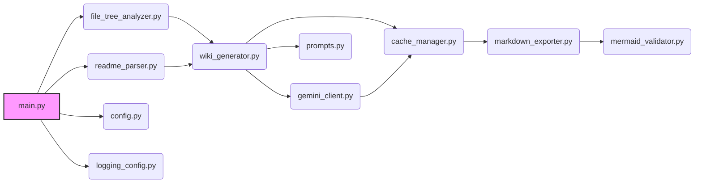
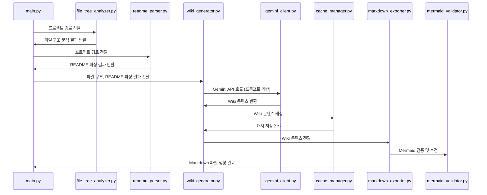
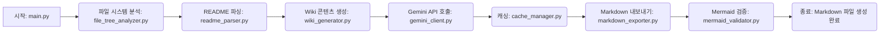
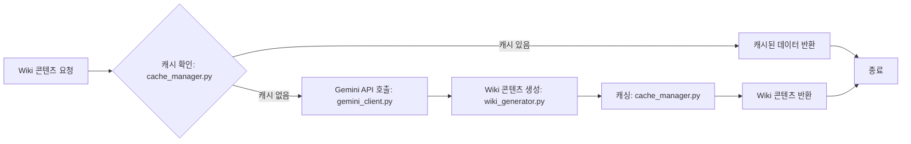

# 전체 시스템 아키텍처 및 디자인 패턴

## 시스템 아키텍처 개요

### 아키텍처 스타일
이 프로젝트는 계층형 아키텍처 스타일을 따릅니다. 각 계층은 특정 책임을 가지며, 명확하게 정의된 인터페이스를 통해 상호 작용합니다. 이는 코드의 모듈성을 높이고 유지 보수를 용이하게 합니다. 주요 계층은 다음과 같습니다:

1.  **프레젠테이션 계층**: `main.py`는 명령줄 인터페이스를 처리하고, 사용자 입력을 받아 다른 계층에 전달합니다.
2.  **비즈니스 로직 계층**: `file_tree_analyzer.py`, `readme_parser.py`, `wiki_generator.py`, `gemini_client.py`는 핵심 로직을 수행합니다. 파일 시스템 분석, README 파싱, Wiki 콘텐츠 생성, LLM과의 상호 작용을 담당합니다.
3.  **데이터 액세스 계층**: `cache_manager.py`는 파일 시스템을 사용하여 데이터를 저장하고 검색합니다. 이는 캐싱 전략을 구현하고 성능을 최적화합니다.
4.  **유틸리티 계층**: `config.py`, `logging_config.py`, `markdown_exporter.py`, `mermaid_validator.py`, `prompts.py`는 설정 관리, 로깅, Markdown 내보내기, Mermaid 검증, 프롬프트 템플릿과 같은 유틸리티 기능을 제공합니다.

### 주요 아키텍처 결정
*   **LLM 활용**: Google Gemini API를 사용하여 Wiki 콘텐츠를 생성하는 핵심 결정을 내렸습니다. 이는 개발자가 수동으로 문서를 작성하는 대신 자동화된 방식으로 고품질 문서를 생성할 수 있도록 합니다.
    *   **이유**: 개발 생산성 향상 및 문서 최신성 유지.
*   **캐싱 전략**: `cache_manager.py`를 통해 캐싱 시스템을 구현하여 LLM API 호출 횟수를 줄이고 성능을 향상시켰습니다.
    *   **이유**: LLM API 호출 비용 절감 및 빠른 응답 시간 확보.
*   **모듈화**: 각 기능별로 모듈을 분리하여 코드의 재사용성과 유지보수성을 높였습니다. 예를 들어, `file_tree_analyzer.py`는 파일 시스템 분석을, `readme_parser.py`는 README 파싱을 담당합니다.
    *   **이유**: 코드 복잡성 감소 및 유지보수 용이성 확보.
*   **Mermaid 다이어그램 검증**: `mermaid_validator.py`를 통해 생성된 Mermaid 다이어그램의 유효성을 검증하고 수정하는 기능을 추가했습니다.
    *   **이유**: 문서 품질 향상 및 다이어그램 오류 방지.

### 컴포넌트 개요
*   `main.py`: 프로그램의 진입점이며, 명령줄 인수를 처리하고 전체 워크플로우를 조정합니다.
*   `file_tree_analyzer.py`: 주어진 프로젝트 경로를 탐색하고 파일 시스템 구조를 분석합니다.
*   `readme_parser.py`: 프로젝트의 README 파일을 파싱하고 관련 정보를 추출합니다.
*   `gemini_client.py`: Google Gemini API와 상호 작용하여 Wiki 콘텐츠를 생성합니다.
*   `wiki_generator.py`: 분석된 프로젝트 정보와 LLM을 사용하여 Wiki 페이지를 생성합니다.
*   `cache_manager.py`: 생성된 Wiki 페이지를 캐싱하고 캐시된 데이터를 검색합니다.
*   `markdown_exporter.py`: Wiki 페이지를 Markdown 파일로 내보냅니다.
*   `mermaid_validator.py`: 생성된 Mermaid 다이어그램의 유효성을 검증하고 수정합니다.
*   `config.py`: 설정 파일을 로드하고 설정 값을 제공합니다.
*   `logging_config.py`: 로깅을 설정하고 로깅 기능을 제공합니다.
*   `prompts.py`: LLM에 사용될 프롬프트 템플릿을 정의합니다.

## 아키텍처 다이어그램

### High-Level 아키텍처

### 컴포넌트 상호작용

## 디자인 패턴

### 패턴 1: 팩토리 패턴
- **타입**: 생성 패턴
- **위치**: `gemini_client.py`
- **목적**: LLM 클라이언트 객체 생성을 캡슐화하여, 클라이언트 구현체의 변경에 유연하게 대처하기 위함. Google Gemini API 클라이언트를 초기화하고 관리하는 데 사용됩니다.
- **구현**: Gemini API 키를 설정하고, 필요한 경우 프록시 설정을 적용하여 LLM 클라이언트를 생성합니다.

### 패턴 2: 전략 패턴
- **타입**: 행위 패턴
- **위치**: `wiki_generator.py`
- **목적**: Wiki 페이지 생성 전략을 캡슐화하여, 다양한 LLM 프롬프트 또는 생성 방식을 유연하게 적용하기 위함.
- **구현**: LLM을 사용하여 Wiki 콘텐츠를 생성하는 다양한 전략(예: 프로젝트 구조, 아키텍처, 규칙, 환경 설정)을 정의하고, 필요에 따라 전략을 선택하여 Wiki 페이지를 생성합니다.

### 패턴 3: 캐시 패턴
- **타입**: 구조 패턴
- **위치**: `cache_manager.py`
- **목적**: LLM API 호출 결과를 캐싱하여 성능을 향상시키고 API 호출 비용을 절감하기 위함.
- **구현**: 파일 시스템을 사용하여 Wiki 페이지를 캐싱하고 캐시된 데이터를 검색합니다. 캐시 유효성 검사 및 만료 정책을 구현하여 캐시된 데이터의 일관성을 유지합니다.

### 패턴 4: 템플릿 메서드 패턴
- **타입**: 행위 패턴
- **위치**: `markdown_exporter.py`와 `mermaid_validator.py` 결합하여 사용
- **목적**: Markdown 내보내기 및 Mermaid 다이어그램 검증/수정 프로세스의 기본 구조를 정의하고, 구체적인 단계를 하위 클래스에서 구현하도록 위임하기 위함.
- **구현**: Markdown 파일 생성의 뼈대를 정의하고, Mermaid 다이어그램 검증 및 수정 단계를 하위 클래스에서 구현하도록 합니다.

## 주요 기능 아키텍처

### 기능 1: 프로젝트 분석 및 Wiki 생성

#### 아키텍처
프로젝트 분석 및 Wiki 생성 기능은 파이프라인 아키텍처를 따릅니다. 각 단계는 특정 작업을 수행하며, 이전 단계의 결과를 다음 단계로 전달합니다.

#### 플로우 다이어그램

#### 주요 컴포넌트
*   `main.py`: 워크플로우 시작 및 조정
*   `file_tree_analyzer.py`: 파일 시스템 분석
*   `readme_parser.py`: README 파싱
*   `wiki_generator.py`: Wiki 콘텐츠 생성
*   `gemini_client.py`: Gemini API 호출
*   `cache_manager.py`: 캐싱
*   `markdown_exporter.py`: Markdown 내보내기
*   `mermaid_validator.py`: Mermaid 검증

### 기능 2: 캐시 관리

#### 아키텍처
캐시 관리 기능은 저장소 패턴을 사용하여 구현됩니다. `cache_manager.py`는 캐시된 데이터를 저장하고 검색하는 데 필요한 모든 작업을 캡슐화합니다.

#### 플로우 다이어그램

#### 주요 컴포넌트
*   `cache_manager.py`: 캐시 저장 및 검색

## 아키텍처 고려 사항

### 확장성
*   LLM을 사용하는 부분은 API 호출 제한에 따라 확장성이 제한될 수 있습니다. 캐싱 전략을 통해 API 호출 횟수를 줄여 확장성을 높일 수 있습니다.
*   모듈화된 아키텍처를 통해 새로운 기능이나 언어 지원을 쉽게 추가할 수 있습니다.

### 유지보수성
*   계층형 아키텍처와 명확하게 정의된 인터페이스를 통해 코드의 모듈성을 높여 유지보수성을 향상시켰습니다.
*   각 모듈은 특정 책임을 가지므로 코드 변경이 다른 모듈에 미치는 영향을 최소화할 수 있습니다.

### 확장성
*   새로운 LLM 모델이나 API를 통합하기 쉽도록 설계되었습니다. `gemini_client.py`를 확장하거나 새로운 클라이언트를 추가하여 다양한 LLM을 지원할 수 있습니다.
*   새로운 Wiki 페이지 유형을 추가하기 쉽도록 설계되었습니다. `wiki_generator.py`를 확장하여 새로운 페이지 유형을 생성하는 로직을 추가할 수 있습니다.
