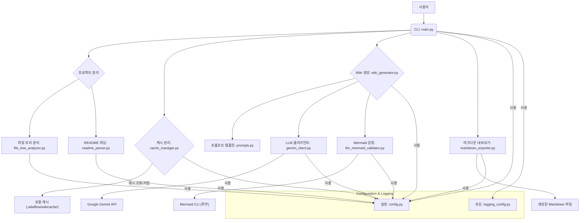
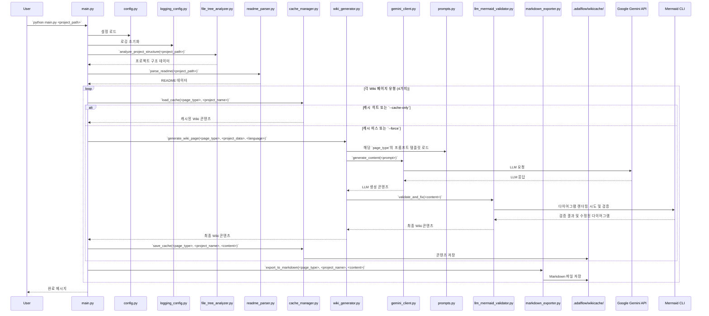
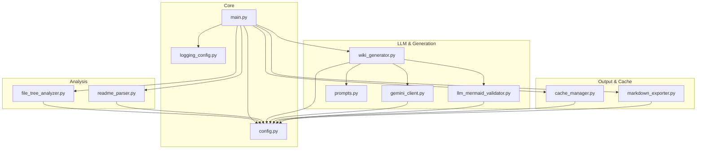
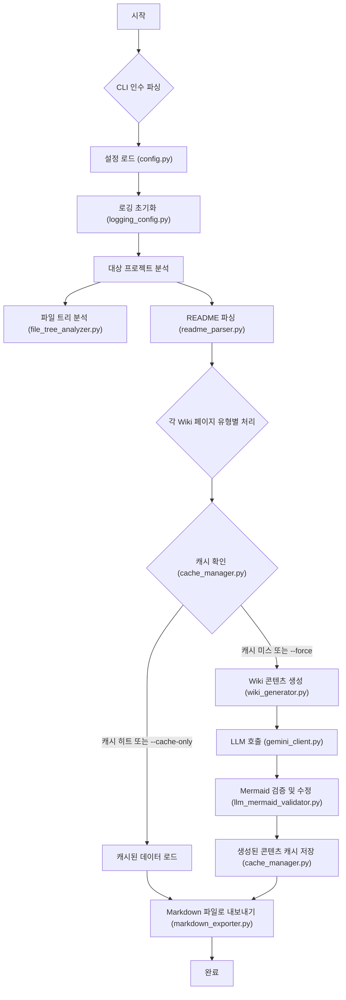
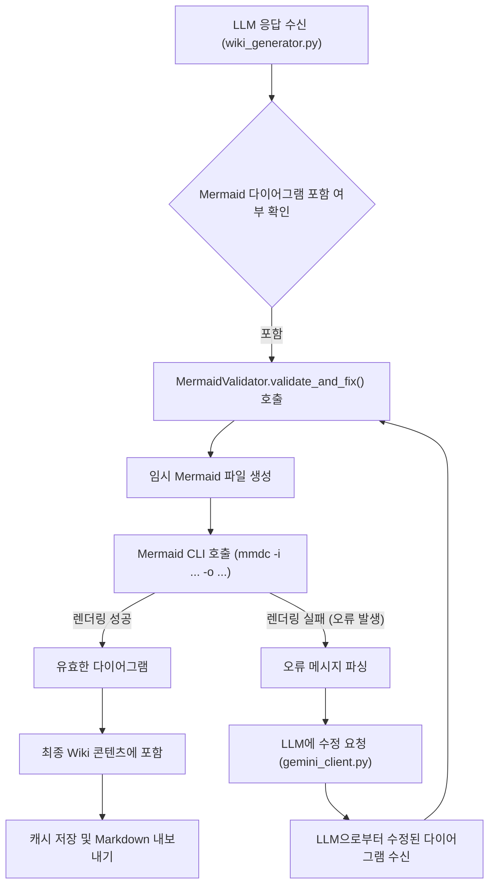

# 전체 시스템 아키텍처 및 디자인 패턴

## 시스템 아키텍처 개요

### 아키텍처 스타일
`python_kb` 프로젝트는 **모듈형 모놀리스(Modular Monolith)** 아키텍처 스타일을 채택하고 있으며, 이는 **계층형 아키텍처(Layered Architecture)** 원칙에 따라 구성되어 있습니다. 각 모듈은 명확한 책임을 가지며, 시스템의 핵심 기능(프로젝트 분석, LLM 기반 문서 생성, 캐싱, 출력)을 논리적인 계층으로 분리하여 응집도를 높이고 결합도를 낮춥니다.

주요 계층은 다음과 같습니다:
*   **프레젠테이션/오케스트레이션 계층**: `main.py`가 CLI 인터페이스를 제공하고 전체 워크플로우를 조정합니다.
*   **애플리케이션/서비스 계층**: `wiki_generator.py`, `cache_manager.py`, `markdown_exporter.py`, `llm_mermaid_validator.py`와 같이 특정 비즈니스 로직을 수행하는 서비스 모듈들이 위치합니다.
*   **도메인/코어 계층**: `file_tree_analyzer.py`, `readme_parser.py`, `prompts.py` 등 프로젝트 분석 및 콘텐츠 생성의 핵심 로직과 데이터 모델을 담당합니다.
*   **인프라/외부 서비스 계층**: `gemini_client.py` (LLM API 연동), `config.py` (환경 설정), `logging_config.py` (로깅) 등 외부 시스템과의 상호작용 및 공통 유틸리티를 처리합니다.

### 주요 아키텍처 결정
1.  **LLM 중심의 콘텐츠 생성**: Google Gemini 2.5 Flash Lite를 활용하여 프로젝트 분석 결과를 기반으로 고품질의 Wiki 문서를 자동으로 생성합니다. 이는 수동 문서 작성의 시간과 노력을 크게 줄이고, 일관된 품질의 문서를 보장합니다.
2.  **캐시 시스템 도입**: DeepWiki와 동일한 캐시 구조(`python_kb/.adalflow/wikicache/`)를 사용하여 LLM API 호출 횟수를 최소화하고, 재실행 시 성능을 향상시키며, API 비용을 절감합니다.
3.  **모듈화된 설계**: 각 기능(파일 분석, README 파싱, LLM 클라이언트, 캐시 관리, 마크다운 내보내기, Mermaid 검증)을 독립적인 모듈로 분리하여 코드의 응집도를 높이고 유지보수성을 향상시켰습니다.
4.  **CLI 기반 인터페이스**: 간단한 명령줄 인터페이스를 통해 사용자가 쉽게 프로젝트를 분석하고 문서를 생성할 수 있도록 합니다.
5.  **Mermaid 다이어그램 자동 검증 및 수정**: 생성된 문서에 포함된 Mermaid 다이어그램의 구문 오류를 자동으로 검증하고 수정하여, 최종 출력물의 품질과 렌더링 가능성을 보장합니다.

### 구성 요소 개요
*   **`main.py`**: 프로그램의 진입점. 명령줄 인수를 파싱하고, 전체 워크플로우를 조정하며, 다른 모듈들을 호출하여 프로젝트 분석 및 Wiki 생성을 지시합니다.
*   **`config.py`**: 환경 변수 및 기타 설정 값을 관리합니다. `.env` 파일에서 설정을 로드하고, 시스템 전반에 걸쳐 공유되는 설정을 제공합니다.
*   **`prompts.py`**: LLM에 전달될 프롬프트 템플릿을 정의합니다. 각 Wiki 페이지 유형(Project Structure, Architecture 등)에 대한 구체적인 프롬프트가 포함되어 있습니다.
*   **`logging_config.py`**: 애플리케이션의 로깅 시스템을 설정합니다.
*   **`file_tree_analyzer.py`**: 대상 프로젝트의 파일 시스템을 탐색하고, 파일 구조 및 내용을 분석하여 프로젝트 메타데이터를 추출합니다. 특정 디렉토리와 파일을 제외하는 규칙을 포함합니다.
*   **`readme_parser.py`**: 대상 프로젝트의 `README.md` 파일을 파싱하여 주요 정보(개요, 특징, 설치 방법 등)를 추출합니다.
*   **`gemini_client.py`**: Google Gemini API와 상호작용하는 클라이언트 역할을 합니다. LLM에 요청을 보내고 응답을 처리합니다.
*   **`wiki_generator.py`**: 프로젝트 분석 결과와 프롬프트 템플릿을 사용하여 LLM에 Wiki 페이지 생성을 요청하고, 응답을 처리하는 핵심 로직을 포함합니다.
*   **`cache_manager.py`**: LLM 응답 및 생성된 Wiki 콘텐츠를 로컬 파일 시스템에 캐시하고, 필요할 때 로드하는 기능을 제공합니다.
*   **`markdown_exporter.py`**: 생성된 Wiki 콘텐츠를 Markdown 파일로 저장합니다.
*   **`llm_mermaid_validator.py`**: LLM이 생성한 Mermaid 다이어그램의 유효성을 검사하고, Mermaid CLI를 통해 실제 렌더링을 시도하여 구문 오류를 수정합니다.

## 아키텍처 다이어그램

### 고수준 아키텍처

### 구성 요소 상호 작용

### 모듈 의존성

## 디자인 패턴

### 1. 파사드 (Facade)
*   **유형**: 구조 (Structural)
*   **위치**: `main.py`
*   **목적**: 복잡한 서브시스템(프로젝트 분석, LLM 호출, 캐싱, 마크다운 내보내기, Mermaid 검증)에 대한 단순화된 인터페이스를 제공합니다. 사용자는 `main.py`를 통해 전체 프로세스를 실행하며, 내부의 복잡한 모듈 간의 상호작용을 직접 알 필요가 없습니다.
*   **구현**: `main.py`는 `file_tree_analyzer`, `readme_parser`, `gemini_client`, `wiki_generator`, `cache_manager`, `markdown_exporter`, `llm_mermaid_validator` 등 여러 모듈의 인스턴스를 생성하고, 이들 간의 호출 순서와 데이터 흐름을 조정합니다. 예를 들어, `main.py`는 분석 결과를 `wiki_generator`에 전달하고, `wiki_generator`는 다시 `gemini_client`와 `llm_mermaid_validator`를 활용하는 식입니다.

### 2. 전략 (Strategy)
*   **유형**: 행동 (Behavioral)
*   **위치**: `wiki_generator.py`와 `prompts.py`의 조합, `file_tree_analyzer.py` 및 `readme_parser.py`
*   **목적**: `wiki_generator.py`는 다양한 유형의 Wiki 페이지(Project Structure, Architecture 등)를 생성해야 합니다. 각 페이지 유형은 고유한 LLM 프롬프트 템플릿을 필요로 합니다. `prompts.py`에 정의된 각 프롬프트는 특정 Wiki 페이지를 생성하기 위한 "전략" 역할을 합니다. 또한, 프로젝트 정보를 수집하는 방식(파일 트리 분석, README 파싱)도 별도의 전략으로 분리되어 있습니다.
*   **구현**: `wiki_generator.generate_wiki_page(page_type, ...)` 메서드는 `page_type` 인수에 따라 `prompts.py`에서 적절한 프롬프트 템플릿을 선택하여 LLM에 전달합니다. `main.py`는 `file_tree_analyzer.analyze()`와 `readme_parser.parse()`를 순차적으로 호출하여 서로 다른 분석 전략을 적용합니다.

### 3. 캐시 (Cache)
*   **유형**: 구조/행동 (Structural/Behavioral) - 저장소(Repository) 패턴의 한 형태
*   **위치**: `cache_manager.py`
*   **목적**: LLM API 호출은 비용과 시간이 소요되므로, 이전에 생성된 Wiki 콘텐츠를 로컬 파일 시스템에 저장하여 재사용합니다. 이는 성능을 향상시키고 API 비용을 절감하며, 네트워크 연결 없이도 캐시된 데이터를 기반으로 마크다운 파일을 생성할 수 있게 합니다.
*   **구현**: `cache_manager.py`는 `load_cache()` 및 `save_cache()` 메서드를 제공합니다. 이 모듈은 프로젝트별로 `.adalflow/wikicache/` 디렉토리 내에 JSON 파일을 생성하여 LLM 응답을 저장하고 관리합니다.

### 4. 의존성 주입 (Dependency Injection) (암묵적)
*   **유형**: 구조 (Structural)
*   **위치**: `main.py` (오케스트레이션), 다양한 모듈의 생성자/함수
*   **목적**: 모듈 간의 결합도를 낮추고 유연성을 높이며 테스트 용이성을 개선합니다. 각 모듈이 필요한 의존성을 직접 생성하는 대신, 외부(주로 `main.py`)에서 인스턴스를 생성하여 전달받도록 합니다.
*   **구현**: `main.py`는 `GeminiClient`, `CacheManager`, `WikiGenerator` 등의 인스턴스를 생성하고, 이들을 다른 모듈의 생성자나 메서드 인수로 전달합니다. 예를 들어, `wiki_generator = WikiGenerator(gemini_client, cache_manager, config)`와 같이 `WikiGenerator`는 `GeminiClient`, `CacheManager`, `Config` 인스턴스를 외부에서 주입받아 사용합니다.

## 주요 기능 아키텍처

### 기능 1: 프로젝트 분석 및 Wiki 문서 생성

#### 아키텍처
이 기능은 `python_kb`의 핵심이며, 여러 모듈이 협력하여 작동하는 파이프라인 형태를 가집니다. `main.py`가 전체 흐름을 조정하며, `file_tree_analyzer.py`와 `readme_parser.py`가 원본 프로젝트 데이터를 수집합니다. 이 데이터는 `wiki_generator.py`로 전달되어 `prompts.py`의 템플릿과 `gemini_client.py`를 통해 LLM에 질의됩니다. LLM 응답은 `llm_mermaid_validator.py`를 거쳐 최종적으로 `cache_manager.py`에 저장되고 `markdown_exporter.py`를 통해 파일로 출력됩니다.

#### 흐름도

#### 주요 구성 요소
*   **`main.py`**: 전체 파이프라인 오케스트레이션.
*   **`file_tree_analyzer.py`**: 프로젝트 파일 구조 분석.
*   **`readme_parser.py`**: README 파일 내용 추출.
*   **`cache_manager.py`**: LLM 응답 및 생성된 콘텐츠 캐싱.
*   **`wiki_generator.py`**: LLM을 활용한 Wiki 콘텐츠 생성 핵심 로직.
*   **`gemini_client.py`**: Google Gemini API와의 통신.
*   **`prompts.py`**: LLM 프롬프트 템플릿 제공.
*   **`llm_mermaid_validator.py`**: Mermaid 다이어그램 유효성 검사 및 수정.
*   **`markdown_exporter.py`**: 최종 Markdown 파일 출력.

### 기능 2: Mermaid 다이어그램 자동 검증 및 수정

#### 아키텍처
이 기능은 `wiki_generator.py` 내에서 LLM이 생성한 콘텐츠를 처리하는 과정의 일부로 통합되어 있습니다. `llm_mermaid_validator.py` 모듈이 핵심 역할을 하며, 외부 `Mermaid CLI` 도구와 연동하여 실제 렌더링을 시도함으로써 다이어그램의 유효성을 검증합니다. 오류가 발견되면 LLM을 다시 호출하여 수정된 다이어그램을 요청하는 방식으로 작동합니다.

#### 흐름도

#### 주요 구성 요소
*   **`llm_mermaid_validator.py`**: Mermaid 다이어그램 검증 및 수정 로직.
*   **`gemini_client.py`**: 수정된 다이어그램을 요청하기 위한 LLM 재호출.
*   **`wiki_generator.py`**: 검증 프로세스를 통합하고 결과를 처리.
*   **Mermaid CLI (외부)**: 실제 다이어그램 렌더링을 수행하는 외부 도구.

## 아키텍처 고려 사항

### 확장성 (Scalability)
*   **LLM 의존성**: LLM API 호출은 외부 서비스에 의존하므로, 확장성은 주로 Google Gemini API의 처리량 및 할당량에 의해 결정됩니다.
*   **로컬 처리**: 프로젝트 분석 및 마크다운 생성과 같은 로컬 작업은 단일 스레드로 실행되지만, 대부분의 프로젝트에서 충분히 빠릅니다. 대규모 프로젝트의 경우 파일 시스템 탐색 시간이 길어질 수 있습니다.
*   **캐싱**: 캐시 시스템은 반복적인 LLM 호출을 줄여 API 비용을 절감하고, 재실행 시 성능을 크게 향상시켜 사용자 경험 측면에서 확장성을 제공합니다.

### 유지보수성 (Maintainability)
*   **모듈화**: 각 기능이 독립적인 모듈로 분리되어 있어, 특정 기능의 변경이 다른 부분에 미치는 영향을 최소화합니다.
*   **중앙 집중식 설정**: `config.py`를 통해 환경 변수 및 기타 설정이 중앙에서 관리되어, 설정 변경이 용이합니다.
*   **프롬프트 분리**: `prompts.py`에 LLM 프롬프트가 별도로 관리되어, LLM의 동작을 조정하거나 새로운 Wiki 페이지 유형을 추가하기 쉽습니다.
*   **로깅**: `logging_config.py`를 통해 체계적인 로깅이 가능하여 문제 발생 시 디버깅 및 진단이 용이합니다.
*   **Mermaid 검증**: 자동화된 Mermaid 검증은 생성된 문서의 품질을 유지하고, 수동 검토의 필요성을 줄여 유지보수 부담을 경감합니다.

### 확장성 (Extensibility)
*   **새로운 LLM 지원**: `gemini_client.py`와 유사한 새로운 클라이언트 모듈을 구현하고 `wiki_generator.py`에서 이를 선택적으로 사용하도록 확장하여 다른 LLM 공급자를 지원할 수 있습니다.
*   **새로운 Wiki 페이지 유형**: `prompts.py`에 새로운 프롬프트 템플릿을 추가하고 `wiki_generator.py`에서 해당 페이지 유형을 처리하는 로직을 확장하여 새로운 Wiki 페이지를 생성할 수 있습니다.
*   **새로운 분석 언어**: `file_tree_analyzer.py`를 수정하여 새로운 프로그래밍 언어의 파일 유형을 인식하고 분석 로직을 추가할 수 있습니다.
*   **출력 형식 다양화**: `markdown_exporter.py`와 유사한 새로운 익스포터 모듈을 구현하여 HTML, PDF 등 다른 출력 형식을 지원할 수 있습니다.
*   **플러그인 아키텍처**: 현재는 명시적인 플러그인 아키텍처는 없지만, 모듈화된 설계 덕분에 향후 특정 분석기나 익스포터를 플러그인 형태로 확장하기 위한 기반이 마련되어 있습니다.