# 전체 시스템 아키텍처 및 디자인 패턴

## 시스템 아키텍처 개요

### 아키텍처 스타일
`python_kb` 프로젝트는 기본적으로 **모듈러(Modular) 아키텍처**와 **파이프라인/배치 처리(Pipeline/Batch Processing) 아키텍처**의 특징을 결합하고 있습니다.

*   **모듈러 아키텍처**: 시스템의 각 기능이 `file_tree_analyzer.py`, `gemini_client.py`, `wiki_generator.py`, `cache_manager.py` 등 독립적인 Python 모듈로 명확하게 분리되어 있습니다. 각 모듈은 단일 책임 원칙을 따르며, 이는 시스템의 유지보수성, 확장성 및 테스트 용이성을 높입니다.
*   **파이프라인/배치 처리 아키텍처**: `main.py`가 전체 프로세스를 오케스트레이션하여, 프로젝트 분석, LLM 기반 콘텐츠 생성, 캐싱, 마크다운 내보내기 및 다이어그램 검증 등 일련의 단계를 순차적으로 실행합니다. 각 단계는 이전 단계의 출력을 다음 단계의 입력으로 사용하여 데이터를 처리하는 파이프라인 형태를 이룹니다.

### 주요 아키텍처 결정
1.  **LLM 기반 콘텐츠 생성**: Google Gemini 2.5 Flash Lite를 활용하여 프로젝트 분석 결과를 기반으로 고품질의 위키 페이지를 자동으로 생성합니다.
    *   **근거**: 개발자의 수동 문서화 부담을 줄이고, LLM의 자연어 처리 능력을 활용하여 다양한 유형의 문서를 일관된 형태로 생성하기 위함입니다.
2.  **캐시 시스템 도입**: `DeepWiki` 프로젝트와 유사한 캐시 구조(`python_kb/.adalflow/wikicache/`)를 사용하여 LLM 호출 결과를 저장하고 재사용합니다.
    *   **근거**: LLM API 호출 비용을 절감하고, 동일한 프로젝트에 대한 반복적인 분석 시 문서 생성 시간을 단축하여 성능을 향상시키기 위함입니다. `--no-cache` 및 `--force` 옵션을 통해 캐시 사용을 제어할 수 있습니다.
3.  **명확한 모듈 분리**: 파일 분석, LLM 클라이언트, 위키 생성 로직, 캐시 관리, 마크다운 내보내기, Mermaid 검증 등 각 기능을 독립적인 모듈로 분리했습니다.
    *   **근거**: 각 기능의 책임을 명확히 하여 코드의 가독성을 높이고, 유지보수 및 향후 기능 확장을 용이하게 합니다. 예를 들어, LLM 클라이언트를 변경하거나 새로운 문서 형식을 추가할 때 특정 모듈만 수정하면 됩니다.
4.  **Mermaid 다이어그램 검증 및 수정**: 생성된 마크다운 내 Mermaid 다이어그램 구문의 유효성을 검증하고 필요한 경우 자동으로 수정하는 기능을 포함합니다.
    *   **근거**: 생성된 문서의 품질을 보장하고, 개발자가 수동으로 다이어그램 오류를 수정해야 하는 번거로움을 줄여 문서의 신뢰성을 높이기 위함입니다.
5.  **CLI 기반 인터페이스**: 모든 작업은 명령줄 인터페이스(`main.py`)를 통해 수행됩니다.
    *   **근거**: 자동화된 스크립트 실행 환경에 적합하며, 개발자가 쉽게 프로젝트를 분석하고 문서를 생성할 수 있도록 단순하고 직접적인 실행 방법을 제공합니다.

### 구성 요소 개요
*   **`main.py`**: 애플리케이션의 진입점 및 오케스트레이터. 명령줄 인자를 파싱하고 전체 워크플로우를 조정합니다.
*   **`config.py`**: 환경 변수 및 기타 애플리케이션 설정을 관리합니다.
*   **`logging_config.py`**: 애플리케이션 전반의 로깅 설정을 담당합니다.
*   **`file_tree_analyzer.py`**: 대상 프로젝트의 파일 시스템 구조를 분석하고 메타데이터를 추출합니다.
*   **`readme_parser.py`**: 대상 프로젝트의 `README.md` 파일을 파싱하여 주요 정보를 추출합니다.
*   **`gemini_client.py`**: Google Gemini API와 통신하는 인터페이스를 제공합니다. LLM 호출 및 응답 처리를 담당합니다.
*   **`prompts.py`**: LLM에게 위키 페이지를 생성하도록 지시하는 프롬프트 템플릿을 정의합니다.
*   **`wiki_generator.py`**: `file_tree_analyzer` 및 `readme_parser`의 결과를 바탕으로 `gemini_client`를 사용하여 실제 위키 콘텐츠를 생성하는 핵심 로직을 포함합니다.
*   **`cache_manager.py`**: 생성된 위키 콘텐츠(JSON 형식)를 디스크에 캐시하고, 필요시 로드하거나 캐시의 유효성을 검사합니다.
*   **`markdown_exporter.py`**: `wiki_generator`에서 생성된 콘텐츠를 마크다운 파일로 변환하여 저장합니다.
*   **`mermaid_validator.py`**: 마크다운 내의 Mermaid 다이어그램 구문을 검증하고, 오류를 수정합니다.

## 아키텍처 다이어그램

### 고수준 시스템 아키텍처

```mermaid
graph TD
A["사용자/CLI"] --> B(main.py)
B --> C;
    C{초기화 & 설정}
C --> D[로깅 설정]
C --> E[환경 변수 로드]
B --> F;
    F{프로젝트 분석}
F --> G[파일 트리 분석]
F --> H[README 파싱]
G --> I[프로젝트 메타데이터]
H --> I
B --> J;
    J{캐시 관리}
J --> K[캐시 존재 확인]
K -- "캐시 유효" --> L[캐시 로드]
K -- "캐시 없음/무효" --> M[LLM 기반 Wiki 생성]
M --> N[Gemini 클라이언트]
N --> O[프롬프트 템플릿]
N -- "API 호출" --> P(Google Gemini API)
P -- "응답" --> N
N -- "콘텐츠 반환" --> M
M -- "생성된 콘텐츠" --> Q[Mermaid 검증 & 수정]
Q -- "검증된 콘텐츠" --> R[캐시 저장]
R --> S[Markdown 내보내기]
S -- ".md 파일" --> T[생성된 Wiki 파일]
L --> S
T[생성된 Wiki 파일]
```

### 구성 요소 상호작용

### 모듈 의존성

## 디자인 패턴

### 1. 파사드 (Facade)
-   **유형**: 구조 (Structural)
-   **위치**: `main.py`
-   **목적**: 프로젝트 분석, LLM 기반