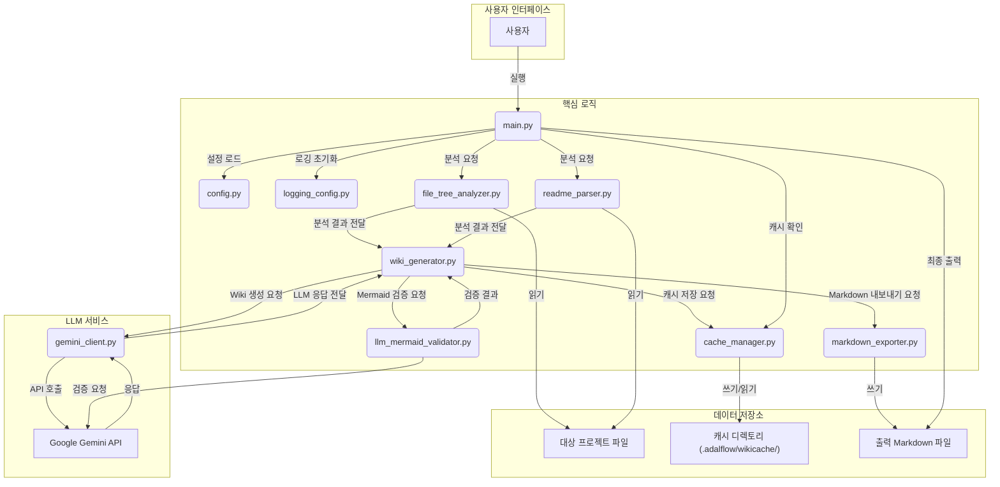
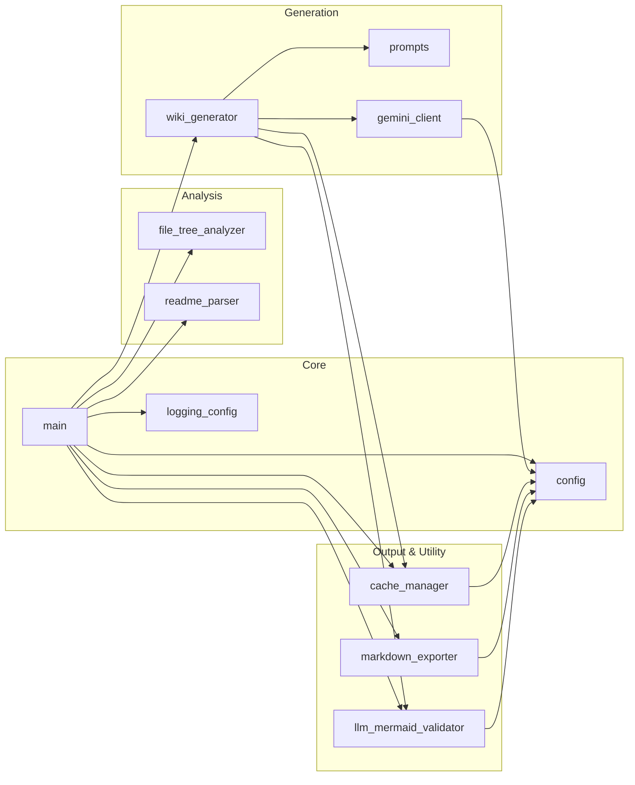
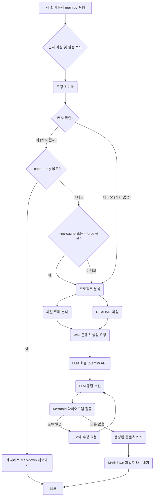

# 프로젝트 구조 및 개요

## 개요
`python_kb` 프로젝트는 로컬 프로젝트의 파일 구조를 분석하고, Google Gemini 2.5 Flash Lite LLM을 활용하여 프로젝트에 대한 지식 기반(Knowledge Base) 문서를 자동으로 생성하는 도구입니다. 이 도구는 Deepwiki 프로젝트의 문서 변환 과정을 참조하여 개발되었으며, "Project Structure & Overview", "Overall System Architecture & Design Patterns", "Conventions", "Environment Setting and Guide"와 같은 Wiki 페이지를 Markdown 형식으로 출력합니다.

## 프로젝트 구조

### 디렉토리 구성
`python_kb` 프로젝트는 단일 Python 패키지로 구성되어 있으며, 모든 소스 코드는 `python_kb/` 디렉토리 내에 평면적으로 배치되어 있습니다. 생성된 Wiki 문서 및 관련 메타데이터는 분석 대상 프로젝트 내의 `.adalflow/wikicache/` 디렉토리에 저장되어 DeepWiki의 캐시 구조를 따릅니다.

### 주요 구성 요소
*   **`main.py`**: 프로젝트의 진입점입니다. 명령줄 인자를 파싱하고, 로깅을 설정하며, 프로젝트 분석, Wiki 생성, 캐싱 및 Markdown 내보내기 과정을 총괄합니다.
*   **`config.py`**: 환경 변수(`GEMINI_API_KEY` 등)를 로드하고, 프로젝트 전반에 걸쳐 사용되는 설정 값을 관리합니다.
*   **`prompts.py`**: LLM(Large Language Model)에 전달될 프롬프트 템플릿을 정의합니다. 다양한 Wiki 페이지 유형(프로젝트 구조, 아키텍처 등)에 대한 프롬프트가 포함되어 있습니다.
*   **`logging_config.py`**: 애플리케이션의 로깅 시스템을 설정합니다. 상세 로그 출력(`--verbose`) 옵션과 연동됩니다.
*   **`file_tree_analyzer.py`**: 대상 프로젝트의 파일 시스템을 탐색하고, 디렉토리 및 파일 구조를 분석하여 LLM이 이해할 수 있는 형태로 변환합니다. 특정 디렉토리 및 파일은 제외 규칙에 따라 분석에서 제외됩니다.
*   **`readme_parser.py`**: 대상 프로젝트의 `README.md` 파일을 파싱하여 주요 정보(개요, 특징 등)를 추출합니다.
*   **`gemini_client.py`**: Google Gemini 2.5 Flash Lite LLM과의 통신을 담당하는 클라이언트 모듈입니다. 프롬프트를 LLM에 전송하고 응답을 받아옵니다.
*   **`wiki_generator.py`**: `file_tree_analyzer`와 `readme_parser`의 분석 결과를 바탕으로 `gemini_client`를 통해 LLM에 Wiki 콘텐츠 생성을 요청하고, 응답을 처리합니다. 캐시 관리 및 Mermaid 다이어그램 검증 로직과 연동됩니다.
*   **`cache_manager.py`**: 생성된 Wiki 콘텐츠(JSON 형식)를 로컬 파일 시스템에 캐시하고, 필요할 때 캐시된 데이터를 로드하는 역할을 합니다. DeepWiki와 동일한 캐시 구조를 사용합니다.
*   **`markdown_exporter.py`**: 생성된 Wiki 콘텐츠를 최종 Markdown 파일로 변환하여 지정된 출력 디렉토리에 저장합니다.
*   **`llm_mermaid_validator.py`**: LLM이 생성한 Mermaid 다이어그램 구문을 검증하고, Mermaid CLI를 통한 실제 렌더링을 시도하여 오류를 확인하고 필요한 경우 LLM을 통해 자동 수정합니다.

### 중요 파일
*   **`main.py`**: 애플리케이션의 시작점 및 전체 워크플로우를 제어합니다.
*   **`config.py`**: 환경 변수 및 핵심 설정을 관리하여 애플리케이션의 동작을 정의합니다.
*   **`requirements.txt`**: 프로젝트의 Python 의존성 패키지 목록을 정의합니다.
*   **`.env.example`**: 환경 변수 설정의 예시를 제공하며, 실제 `.env` 파일은 민감한 정보를 포함합니다.

## 주요 기능

### 1. 자동 프로젝트 분석
-   **설명**: 대상 프로젝트의 파일 시스템 구조와 `README.md` 파일을 자동으로 분석하여 LLM이 Wiki 콘텐츠를 생성하는 데 필요한 정보를 수집합니다.
-   **구현**: `file_tree_analyzer.py`는 지정된 경로의 디렉토리와 파일을 재귀적으로 탐색하며, `.git`, `node_modules`, `__pycache__` 등 미리 정의된 제외 규칙에 따라 불필요한 파일을 걸러냅니다. `readme_parser.py`는 `README.md` 파일의 내용을 읽어 주요 섹션을 추출합니다.
-   **관련 파일**: `file_tree_analyzer.py`, `readme_parser.py`, `config.py` (제외 규칙 정의)

### 2. LLM 기반 고품질 문서 생성
-   **설명**: Google Gemini 2.5 Flash Lite LLM을 사용하여 분석된 프로젝트 정보를 바탕으로 "Project Structure & Overview", "Overall System Architecture & Design Patterns" 등 4가지 유형의 Wiki 페이지를 자동으로 생성합니다.
-   **구현**: `wiki_generator.py`가 분석 결과를 `prompts.py`에 정의된 템플릿과 결합하여 `gemini_client.py`를 통해 Gemini API에 요청을 보냅니다. LLM의 응답을 받아 Wiki 콘텐츠로 가공합니다.
-   **관련 파일**: `wiki_generator.py`, `gemini_client.py`, `prompts.py`, `config.py` (API 키 설정)

### 3. 캐시 시스템
-   **설명**: 한 번 생성된 Wiki 콘텐츠(JSON 형식)를 로컬 파일 시스템에 캐시하여, 동일한 프로젝트에 대해 다시 문서를 생성할 때 LLM 호출 없이 빠르게 결과를 제공합니다. DeepWiki와 동일한 캐시 구조를 사용합니다.
-   **구현**: `cache_manager.py`가 캐시 파일의 저장 및 로드 로직을 담당합니다. `--no-cache` 또는 `--force` 옵션을 통해 캐시 사용 여부를 제어할 수 있습니다.
-   **관련 파일**: `cache_manager.py`, `main.py` (캐시 옵션 처리)

### 4. Markdown 출력
-   **설명**: 생성된 Wiki 콘텐츠를 표준 Markdown 파일 형식으로 변환하여 지정된 캐시 디렉토리에 저장합니다.
-   **구현**: `markdown_exporter.py`가 JSON 형식의 Wiki 데이터를 Markdown 문자열로 변환하고, 이를 파일로 저장합니다.
-   **관련 파일**: `markdown_exporter.py`, `wiki_generator.py`

### 5. 실제 렌더링 기반 Mermaid 다이어그램 검증 및 자동 수정
-   **설명**: LLM이 생성한 Mermaid 다이어그램 구문의 유효성을 검증하고, Mermaid CLI를 사용하여 실제 렌더링을 시도합니다. 구문 오류가 발견되면 LLM을 다시 호출하여 오류를 수정합니다.
-   **구현**: `llm_mermaid_validator.py`가 Mermaid CLI를 호출하여 렌더링을 시도하고, 실패 시 LLM에 오류 메시지와 함께 수정 요청을 보냅니다. 이를 통해 생성된 다이어그램의 품질과 정확성을 보장합니다.
-   **관련 파일**: `llm_mermaid_validator.py`, `wiki_generator.py`, `gemini_client.py`

### 6. 다국어 지원
-   **설명**: 생성되는 Wiki 문서의 언어를 한국어 또는 영어로 선택할 수 있습니다.
-   **구현**: `main.py`에서 `--language` 옵션을 통해 언어를 지정하며, `prompts.py`에서 해당 언어에 맞는 프롬프트 템플릿을 사용하여 LLM에 요청을 보냅니다.
-   **관련 파일**: `main.py`, `prompts.py`

### 7. 독립 실행
-   **설명**: `python_chunking` 프로젝트와 독립적으로 실행될 수 있도록 설계되어, 어떤 로컬 프로젝트든 분석하여 Wiki를 생성할 수 있습니다.
-   **구현**: `main.py`가 `project_path` 인자를 받아 대상 프로젝트를 지정하며, 내부적으로 필요한 모든 의존성을 관리합니다.
-   **관련 파일**: `main.py`

## 아키텍처 다이어그램



## 모듈 다이어그램



## 데이터/실행 흐름 다이어그램



## 파일 구조 상세
```
python_kb/
├── README.md                   # 프로젝트에 대한 설명, 기능, 설치 및 사용법을 담고 있는 문서
├── __init__.py                 # python_kb 디렉토리를 Python 패키지로 인식하게 하는 파일
├── cache_manager.py            # 생성된 Wiki 콘텐츠를 캐시하고 관리하는 로직 포함
├── config.py                   # 환경 변수 로드 및 애플리케이션 전반의 설정 관리
├── file_tree_analyzer.py       # 대상 프로젝트의 파일 및 디렉토리 구조를 분석하는 모듈
├── gemini_client.py            # Google Gemini LLM API와 통신하는 클라이언트
├── llm_mermaid_validator.py    # LLM이 생성한 Mermaid 다이어그램의 유효성을 검증하고 수정하는 모듈
├── logging_config.py           # 애플리케이션의 로깅 설정을 정의
├── main.py                     # 프로젝트의 메인 실행 파일이자 진입점
├── markdown_exporter.py        # 생성된 Wiki 콘텐츠를 Markdown 형식으로 변환하여 내보내는 모듈
├── prompts.py                  # LLM에 전달될 다양한 Wiki 페이지 유형별 프롬프트 템플릿 정의
├── readme_parser.py            # 대상 프로젝트의 README.md 파일을 파싱하여 주요 정보를 추출
├── requirements.txt            # 프로젝트의 Python 의존성 패키지 목록
├── test_example.py             # 예시 테스트 파일 (개발 중 사용될 수 있음)
├── test_llm_validator.py       # llm_mermaid_validator 모듈에 대한 테스트 파일
└── wiki_generator.py           # 프로젝트 분석 결과를 바탕으로 LLM을 통해 Wiki 콘텐츠를 생성하는 핵심 로직
```