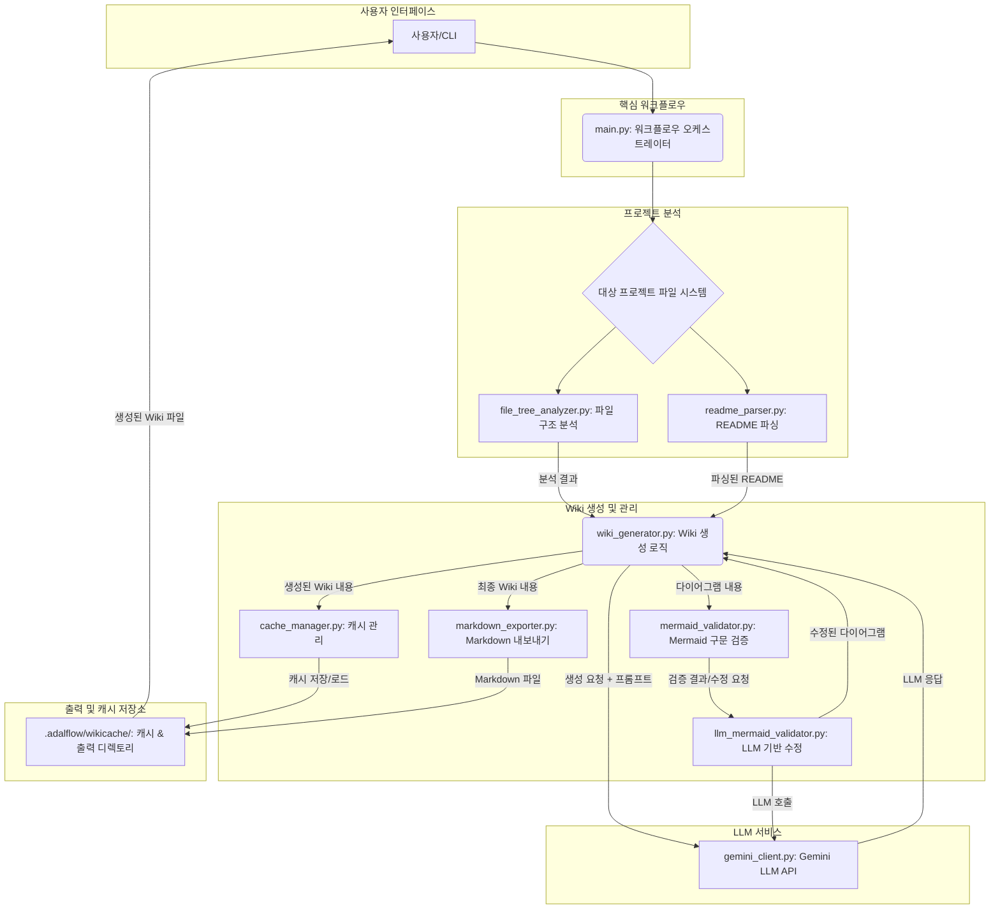
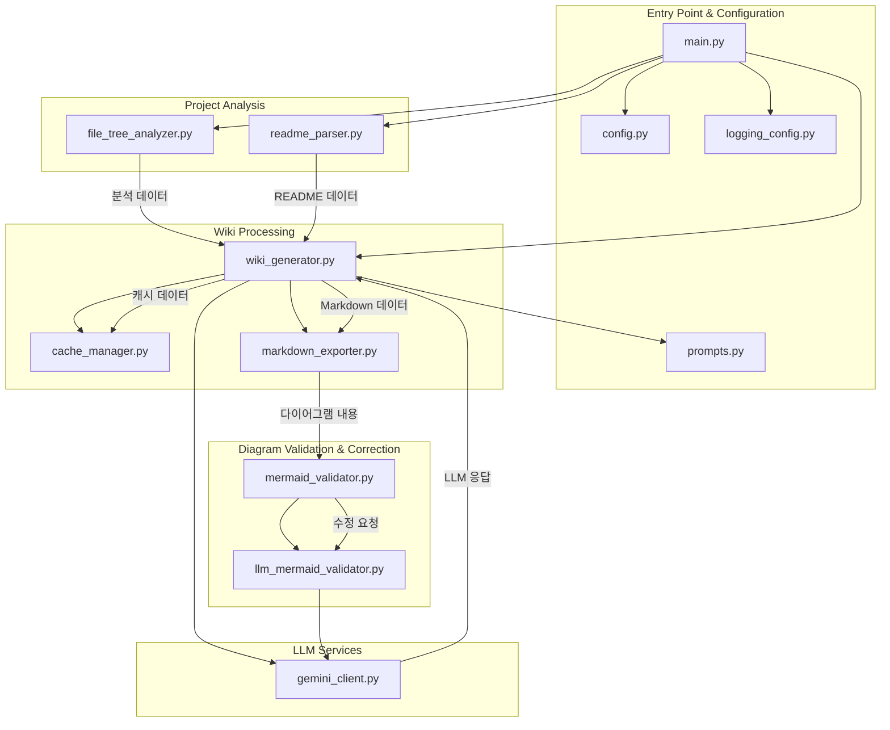
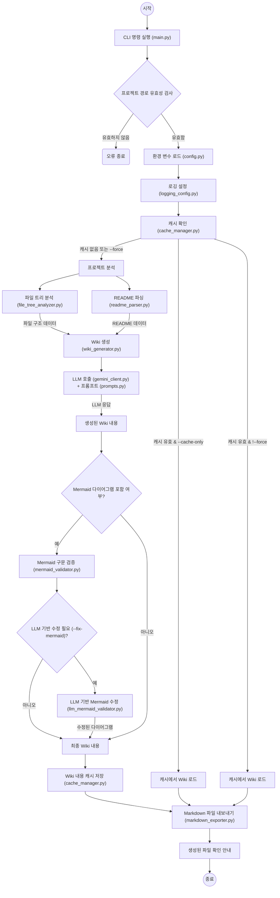

# 프로젝트 구조 및 개요

## 개요
`python_kb`는 로컬 프로젝트의 구조를 분석하고, Google Gemini 2.5 Flash Lite LLM(Large Language Model)을 활용하여 Knowledge Base 문서를 자동으로 생성하는 도구입니다. Deepwiki 프로젝트의 변환 과정을 참조하여 개발되었으며, 다음 네 가지 유형의 Wiki 페이지를 Markdown 형식으로 출력합니다: 프로젝트 구조 및 주요 기능, 시스템 아키텍처 및 디자인 패턴, 명명 및 코딩 규칙, 환경 설정 가이드.

주요 특징으로는 자동 프로젝트 분석, LLM 기반의 고품질 문서 생성, DeepWiki와 동일한 캐시 시스템, Markdown 출력, LLM 기반의 지능형 Mermaid 다이어그램 구문 검증 및 자동 수정, 그리고 한국어/영어 다국어 지원 등이 있습니다. `python_chunking` 프로젝트와 독립적으로 실행 가능하며, Python, Java, JavaScript, TypeScript 프로젝트를 지원합니다.

## 프로젝트 구조

### 디렉토리 구성
`python_kb` 프로젝트는 대부분의 소스 파일이 최상위 디렉토리에 평면적으로 구성되어 있습니다.
*   `python_kb/`: 프로젝트의 모든 소스 코드와 설정 파일이 위치하는 루트 디렉토리입니다.
*   `python_kb/.adalflow/wikicache/`: (런타임 시 생성) 생성된 Wiki 문서와 캐시 데이터가 저장되는 디렉토리입니다. 분석 대상 프로젝트별로 하위 디렉토리가 생성됩니다 (예: `python_kb/.adalflow/wikicache/python_chunking/`).

### 주요 구성 요소 (모듈)
프로젝트의 핵심 기능을 담당하는 주요 Python 모듈은 다음과 같습니다:

*   **`main.py`**: 프로젝트의 진입점(Entry Point)이자 CLI(Command Line Interface)를 제공합니다. 전체 워크플로우를 오케스트레이션하며, 사용자 입력 및 옵션을 처리합니다.
*   **`config.py`**: 환경 변수 로드 및 애플리케이션 전반에 걸친 설정 값(예: API 키, 캐시 경로, 제외 규칙)을 관리합니다.
*   **`prompts.py`**: LLM(Google Gemini)에 전달될 다양한 Wiki 페이지 생성용 프롬프트 템플릿을 정의합니다. LLM의 출력 품질에 직접적인 영향을 미칩니다.
*   **`logging_config.py`**: 애플리케이션의 로깅 시스템을 설정하여 실행 중 발생하는 정보를 기록하고 관리합니다.
*   **`file_tree_analyzer.py`**: 분석 대상 프로젝트의 파일 시스템을 탐색하고, 디렉토리 및 파일 구조, 코드 언어 등을 분석하여 구조화된 데이터를 생성합니다.
*   **`readme_parser.py`**: 분석 대상 프로젝트의 `README.md` 파일을 파싱하여 프로젝트 개요, 특징, 설치 방법 등 핵심 정보를 추출합니다.
*   **`gemini_client.py`**: Google Gemini 2.5 Flash Lite LLM API와 통신하는 인터페이스를 제공합니다. 프롬프트를 전송하고 LLM의 응답을 처리합니다.
*   **`wiki_generator.py`**: `file_tree_analyzer.py`와 `readme_parser.py`에서 얻은 분석 데이터를 기반으로 `gemini_client.py`를 통해 LLM을 호출하여 실제 Wiki 페이지 내용을 생성하는 핵심 로직을 담당합니다.
*   **`cache_manager.py`**: 생성된 Wiki 내용(JSON 형식) 및 프로젝트 메타데이터를 캐시 디렉토리(`python_kb/.adalflow/wikicache/`)에 저장하고, 필요시 로드하여 재활용하는 기능을 관리합니다.
*   **`markdown_exporter.py`**: `wiki_generator.py`에서 생성된 Wiki 내용을 표준 Markdown 파일(`.md`)로 변환하여 캐시 디렉토리에 저장합니다.
*   **`mermaid_validator.py`**: 생성된 Wiki 내용에 포함된 Mermaid 다이어그램의 구문 유효성을 기본적인 규칙에 따라 검증합니다.
*   **`llm_mermaid_validator.py`**: `mermaid_validator.py`에서 발견된 복잡한 Mermaid 구문 오류를 LLM(`gemini_client.py` 사용)을 통해 지능적으로 분석하고 자동으로 수정하는 기능을 제공합니다.

### 중요 파일
프로젝트의 동작에 핵심적인 역할을 하는 파일들은 다음과 같습니다:

*   **`main.py`**: 프로젝트 실행의 시작점이며, 모든 기능의 흐름을 제어합니다.
*   **`requirements.txt`**: 프로젝트가 의존하는 모든 Python 패키지 목록을 정의하여 환경 설정의 일관성을 보장합니다.
*   **`.env.example`**: 환경 변수 설정의 예시를 제공하여 사용자가 API 키와 같은 민감 정보를 쉽게 설정할 수 있도록 돕습니다. 실제 사용 시에는 `.env` 파일로 복사하여 사용합니다.
*   **`config.py`**: 애플리케이션의 전역 설정을 중앙에서 관리하여 코드의 유지보수성을 높입니다.
*   **`prompts.py`**: LLM의 응답 품질을 결정하는 핵심 요소로, 다양한 Wiki 페이지 유형에 맞는 프롬프트 템플릿을 포함합니다.

## 주요 기능

### 1. 자동 프로젝트 분석
*   **설명**: 대상 로컬 프로젝트의 파일 시스템 구조와 `README.md` 파일을 자동으로 분석하여 프로젝트의 핵심 메타데이터와 구조 정보를 추출합니다.
*   **구현**: `file_tree_analyzer.py`가 디렉토리 탐색 및 파일 유형 식별을 담당하고, `readme_parser.py`가 `README.md` 파일의 내용을 파싱하여 구조화된 데이터를 생성합니다.
*   **관련 파일**: `file_tree_analyzer.py`, `readme_parser.py`, `main.py` (분석 시작 및 결과 전달).

### 2. LLM 기반 문서 생성
*   **설명**: Google Gemini 2.5 Flash Lite LLM을 활용하여 분석된 프로젝트 정보를 바탕으로 고품질의 Wiki 문서를 자동으로 생성합니다.
*   **구현**: `gemini_client.py`가 LLM API와의 통신을 처리하고, `prompts.py`에 정의된 템플릿을 사용하여 `wiki_generator.py`가 최종 Wiki 내용을 생성합니다.
*   **관련 파일**: `gemini_client.py`, `prompts.py`, `wiki_generator.py`.

### 3. 캐시 시스템
*   **설명**: DeepWiki와 동일한 캐시 구조를 채택하여, 이전에 생성된 Wiki 내용과 메타데이터를 `.adalflow/wikicache/` 디렉토리에 저장하고 재활용합니다. 이를 통해 불필요한 LLM 호출을 줄여 비용과 시간을 절약합니다.
*   **구현**: `cache_manager.py`가 캐시 파일의 읽기, 쓰기, 유효성 검사를 담당합니다. `--no-cache`, `--force`, `--cache-only`와 같은 CLI 옵션을 통해 캐시 동작을 제어할 수 있습니다.
*   **관련 파일**: `cache_manager.py`, `main.py` (캐시 옵션 처리), `wiki_generator.py` (캐시 활용 로직).

### 4. Markdown 출력
*   **설명**: LLM을 통해 생성된 Wiki 페이지 내용을 표준 Markdown 파일(`.md`) 형식으로 변환하여 지정된 캐시 디렉토리에 저장합니다.
*   **구현**: `markdown_exporter.py`가 LLM으로부터 받은 텍스트를 Markdown 형식으로 포맷팅하고 파일 시스템에 저장하는 역할을 수행합니다.
*   **관련 파일**: `markdown_exporter.py`, `wiki_generator.py`.

### 5. LLM 기반 Mermaid 검증 및 수정
*   **설명**: 생성된 Wiki 문서에 포함된 Mermaid 다이어그램의 구문 오류를 지능적으로 검증하고, 필요시 LLM을 활용하여 자동으로 수정합니다.
*   **구현**: `mermaid_validator.py`가 기본적인 Mermaid 구문 검증을 수행하며, `llm_mermaid_validator.py`는 LLM을 호출하여 복잡하거나 의미론적인 오류를 수정합니다. `--validate-mermaid` 및 `--fix-mermaid` 옵션으로 이 기능을 활성화할 수 있습니다.
*   **관련 파일**: `mermaid_validator.py`, `llm_mermaid_validator.py`, `gemini_client.py`, `main.py` (옵션 처리).

### 6. 다국어 지원
*   **설명**: 생성되는 Wiki 문서의 언어를 한국어 또는 영어로 선택할 수 있도록 지원합니다.
*   **구현**: `prompts.py` 내에 언어별로 정의된 프롬프트 템플릿이 있으며, `main.py`의 `--language` CLI 옵션을 통해 원하는 출력 언어를 선택합니다.
*   **관련 파일**: `prompts.py`, `main.py`.

## 아키텍처 다이어그램



## 모듈 다이어그램



## 흐름 다이어그램



## 파일 구조 상세

```
python_kb/
├── __init__.py                 # Python 패키지 초기화 파일
├── main.py                     # 프로젝트의 메인 실행 스크립트, CLI 인터페이스 및 전체 워크플로우 제어
├── config.py                   # 환경 변수 및 기타 설정 값 관리
├── prompts.py                  # LLM (Gemini)에 전달될 프롬프트 템플릿 정의 (DeepWiki 참조)
├── logging_config.py           # 애플리케이션 로깅 설정
├── file_tree_analyzer.py       # 대상 프로젝트의 파일 및 디렉토리 구조를 분석
├── readme_parser.py            # 대상 프로젝트의 README.md 파일을 파싱하여 주요 정보 추출
├── gemini_client.py            # Google Gemini 2.5 Flash Lite LLM API와 통신하는 클라이언트
├── wiki_generator.py           # 분석된 데이터를 기반으로 LLM을 활용하여 Wiki 페이지를 생성하는 핵심 로직
├── cache_manager.py            # 생성된 Wiki 내용 및 메타데이터를 캐시하고 관리
├── markdown_exporter.py        # 생성된 Wiki 내용을 Markdown 파일로 변환하여 저장
├── mermaid_validator.py        # 생성된 Mermaid 다이어그램의 구문 유효성을 검증
├── llm_mermaid_validator.py    # LLM을 사용하여 Mermaid 다이어그램 구문 오류를 지능적으로 수정
├── requirements.txt            # 프로젝트 의존성 Python 패키지 목록
├── .env.example                # 환경 변수 설정 예시 파일
├── README.md                   # 이 프로젝트에 대한 설명 문서
├── LLM_MERMAID_VALIDATOR_GUIDE.md # LLM 기반 Mermaid 검증 기능에 대한 가이드 문서
├── test_example.py             # 예시 테스트 파일 (개발/디버깅용)
└── test_llm_validator.py       # LLM 기반 Mermaid 검증 기능에 대한 테스트 파일
```