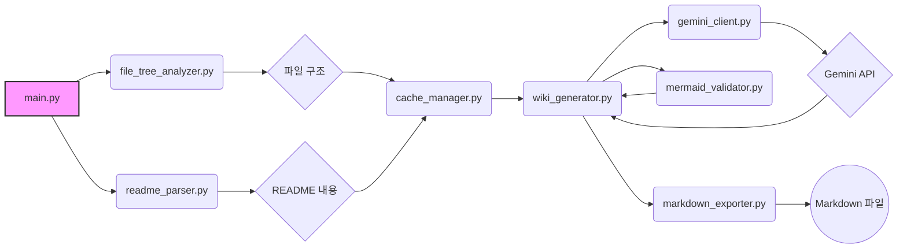
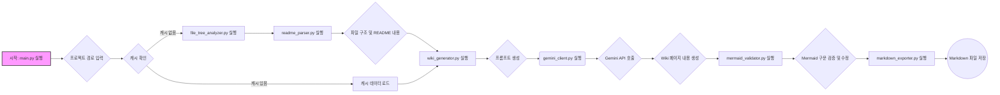

# 프로젝트 구조 & 개요

## 개요

python_kb는 로컬 프로젝트의 구조를 분석하여 자동으로 Knowledge Base를 생성하는 도구입니다. Deepwiki 프로젝트의 변환 과정을 참조하여 만들어졌으며, LLM(Google Gemini 2.0 Flash Exp)을 사용하여 프로젝트 구조, 시스템 아키텍처, 코딩 규칙, 환경 설정 가이드 등의 Wiki 페이지를 자동으로 생성합니다. 자동 프로젝트 분석, LLM 기반 문서 생성, 캐시 시스템, Markdown 출력, Mermaid 검증, 다국어 지원 등의 특징을 가지고 있으며, Python, Java, JavaScript, TypeScript 등의 언어를 지원합니다. python_chunking 프로젝트와 독립적으로 실행 가능합니다.

## 프로젝트 구조

### 디렉토리 구성

프로젝트는 다음과 같은 디렉토리 구조를 가집니다:

```
python_kb/
├── __init__.py
├── main.py
├── config.py
├── prompts.py
├── logging_config.py
├── file_tree_analyzer.py
├── readme_parser.py
├── gemini_client.py
├── wiki_generator.py
├── cache_manager.py
├── markdown_exporter.py
├── mermaid_validator.py
├── requirements.txt
├── .env.example
└── README.md
```

*   **최상위 디렉토리 (python_kb/)**: 프로젝트의 루트 디렉토리이며, 모든 소스 코드, 설정 파일, 문서 등이 포함되어 있습니다.
*   **python_kb/.adalflow/wikicache/<project_name>/**: 분석된 프로젝트의 캐시 데이터 및 생성된 Markdown 파일이 저장되는 디렉토리입니다. `<project_name>`은 분석 대상 프로젝트의 이름입니다.

### 주요 컴포넌트

*   **main.py**: 프로그램의 진입점입니다. 명령줄 인수를 처리하고, 프로젝트 분석을 시작하며, Wiki 생성을 트리거합니다.
*   **config.py**: 프로젝트의 설정을 관리합니다. Gemini API 키, 캐시 디렉토리 경로, 언어 설정 등과 같은 환경 변수를 로드하고 제공합니다.
*   **prompts.py**: LLM에게 전달될 프롬프트 템플릿을 정의합니다. Wiki 페이지의 내용을 생성하는 데 사용되는 텍스트 템플릿을 포함합니다. Deepwiki 프로젝트의 프롬프트를 참조했습니다.
*   **file_tree_analyzer.py**: 주어진 프로젝트 경로를 탐색하고 파일 트리를 생성합니다. 지원되는 언어의 파일만 포함하고, 제외 규칙에 따라 특정 디렉토리 및 파일을 필터링합니다.
*   **readme_parser.py**: 프로젝트의 README 파일을 파싱하여 프로젝트에 대한 정보를 추출합니다.
*   **gemini_client.py**: Google Gemini API와 통신하기 위한 클라이언트 역할을 합니다. 프롬프트를 Gemini API에 보내고 응답을 받아옵니다.
*   **wiki_generator.py**: 프로젝트 구조, 아키텍처, 규칙, 환경 설정 가이드 등의 Wiki 페이지 내용을 생성하는 핵심 로직을 담당합니다. LLM을 사용하여 내용을 생성하고, Mermaid 다이어그램을 포함합니다.
*   **cache_manager.py**: 프로젝트 분석 결과 및 생성된 Wiki 페이지를 캐싱하고 관리합니다. 캐시를 사용하여 불필요한 LLM 호출을 줄이고 처리 속도를 향상시킵니다.
*   **markdown_exporter.py**: 생성된 Wiki 페이지 내용을 Markdown 파일로 내보냅니다.
*   **mermaid_validator.py**: Mermaid 다이어그램의 구문 오류를 검증하고 수정합니다.
*   **logging_config.py**: 로깅 설정을 관리합니다.

### 중요 파일

*   **main.py**: 메인 실행 파일. 프로젝트 분석을 시작하고 Wiki 생성을 트리거합니다.
*   **config.py**: 설정 파일. Gemini API 키 및 기타 설정을 관리합니다.
*   **prompts.py**: 프롬프트 템플릿. LLM이 Wiki 페이지 내용을 생성하는 데 사용됩니다.
*   **file_tree_analyzer.py**: 파일 트리 분석기. 프로젝트의 파일 구조를 분석합니다.
*   **wiki_generator.py**: Wiki 생성기. LLM을 사용하여 Wiki 페이지 내용을 생성합니다.
*   **cache_manager.py**: 캐시 관리자. 프로젝트 분석 결과 및 생성된 Wiki 페이지를 캐싱합니다.

## 주요 기능

### 기능 1: 자동 프로젝트 분석

*   **설명**: 지정된 프로젝트 경로의 파일 구조를 자동으로 분석합니다. 제외 규칙에 따라 특정 디렉토리 및 파일을 필터링하고, 지원되는 언어의 파일만 포함합니다. README 파일을 파싱하여 프로젝트 정보를 추출합니다.
*   **구현**: `file_tree_analyzer.py` 파일에서 파일 트리를 생성하고, `readme_parser.py` 파일에서 README 파일을 파싱합니다. 제외 규칙은 `file_tree_analyzer.py` 내에 정의되어 있습니다.
*   **관련 파일**: `file_tree_analyzer.py`, `readme_parser.py`

### 기능 2: LLM 기반 Wiki 페이지 생성

*   **설명**: Google Gemini API를 사용하여 프로젝트 구조, 아키텍처, 규칙, 환경 설정 가이드 등의 Wiki 페이지 내용을 자동으로 생성합니다. 프롬프트 템플릿을 사용하여 LLM에게 적절한 지시를 내리고, 응답을 받아 Wiki 페이지 내용을 구성합니다.
*   **구현**: `wiki_generator.py` 파일에서 Gemini API를 호출하고, 응답을 파싱하여 Wiki 페이지 내용을 생성합니다. 프롬프트 템플릿은 `prompts.py` 파일에 정의되어 있습니다.
*   **관련 파일**: `wiki_generator.py`, `gemini_client.py`, `prompts.py`

### 기능 3: 캐시 시스템

*   **설명**: 프로젝트 분석 결과 및 생성된 Wiki 페이지 내용을 캐싱하여 불필요한 LLM 호출을 줄이고 처리 속도를 향상시킵니다. 캐시를 사용하여 이전에 분석된 프로젝트에 대한 Wiki 페이지를 빠르게 생성할 수 있습니다.
*   **구현**: `cache_manager.py` 파일에서 캐시를 관리합니다. 프로젝트 분석 결과 및 생성된 Wiki 페이지 내용은 JSON 형식으로 저장됩니다.
*   **관련 파일**: `cache_manager.py`

### 기능 4: Mermaid 다이어그램 검증 및 수정

*   **설명**: 생성된 Wiki 페이지에 포함된 Mermaid 다이어그램의 구문 오류를 검증하고 수정합니다. 유효하지 않은 Mermaid 구문은 Wiki 페이지에 올바르게 렌더링되지 않으므로, 이 기능을 통해 다이어그램의 품질을 향상시킵니다.
*   **구현**: `mermaid_validator.py` 파일에서 Mermaid 다이어그램의 구문 오류를 검증하고 수정합니다. 정규 표현식 및 기타 방법을 사용하여 구문 오류를 감지하고 수정합니다.
*   **관련 파일**: `mermaid_validator.py`

## 아키텍처 다이어그램



## 흐름 다이어그램



## 파일 구조 상세 정보

```
python_kb/
├── README.md: 프로젝트에 대한 전반적인 설명 및 사용법을 담고 있습니다.
├── __init__.py: Python 패키지로 만들기 위한 초기화 파일입니다.
├── cache_manager.py: 프로젝트 분석 결과 및 생성된 Wiki 페이지를 캐싱하고 관리합니다.
├── config.py: Gemini API 키, 캐시 디렉토리 경로, 언어 설정 등과 같은 환경 변수를 로드하고 제공합니다.
├── file_tree_analyzer.py: 주어진 프로젝트 경로를 탐색하고 파일 트리를 생성합니다.
├── gemini_client.py: Google Gemini API와 통신하기 위한 클라이언트 역할을 합니다.
├── logging_config.py: 로깅 설정을 관리합니다.
├── main.py: 프로그램의 진입점입니다. 명령줄 인수를 처리하고, 프로젝트 분석을 시작하며, Wiki 생성을 트리거합니다.
├── markdown_exporter.py: 생성된 Wiki 페이지 내용을 Markdown 파일로 내보냅니다.
├── mermaid_validator.py: Mermaid 다이어그램의 구문 오류를 검증하고 수정합니다.
├── prompts.py: LLM에게 전달될 프롬프트 템플릿을 정의합니다.
├── readme_parser.py: 프로젝트의 README 파일을 파싱하여 프로젝트 정보를 추출합니다.
├── requirements.txt: 프로젝트에 필요한 Python 패키지 목록을 정의합니다.
├── test_example.py: 프로젝트 테스트 예제 파일입니다.
└── wiki_generator.py: 프로젝트 구조, 아키텍처, 규칙, 환경 설정 가이드 등의 Wiki 페이지 내용을 생성하는 핵심 로직을 담당합니다.
```
