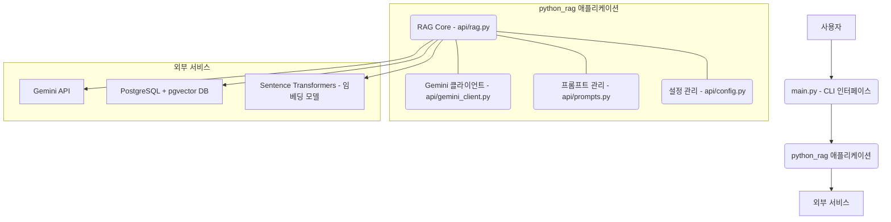
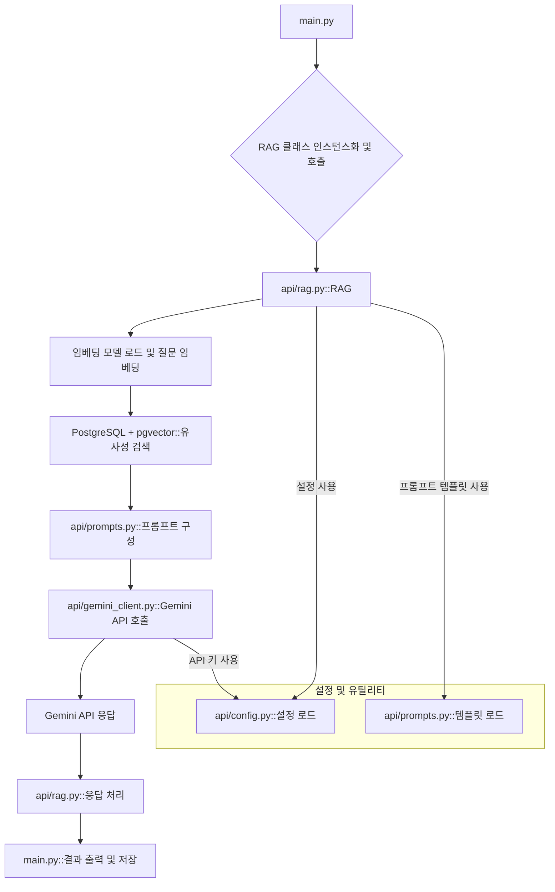
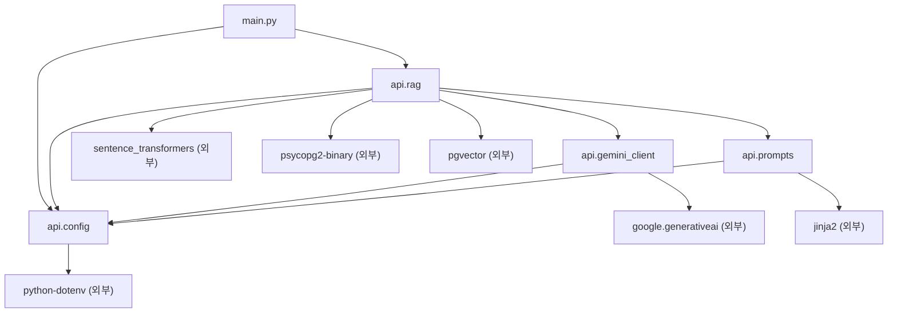
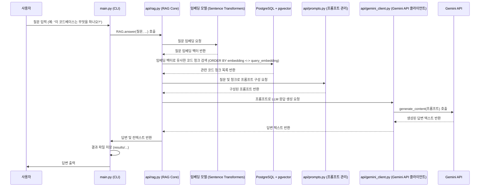

# 전체 시스템 아키텍처 및 디자인 패턴

## 시스템 아키텍처 개요

### 아키텍처 스타일
`python_rag` 프로젝트는 기본적으로 **계층형 아키텍처(Layered Architecture)** 스타일을 따르는 **CLI 기반 모놀리식 애플리케이션(CLI-based Monolithic Application)**으로 설계되었습니다. 이 아키텍처는 명확한 책임 분리와 모듈화를 통해 시스템의 이해와 유지보수를 용이하게 합니다.

*   **프레젠테이션 계층 (Presentation Layer)**: `main.py` 파일이 사용자 인터페이스(CLI) 역할을 하며, 사용자 입력을 처리하고 핵심 RAG 로직을 호출합니다.
*   **애플리케이션/서비스 계층 (Application/Service Layer)**: `api/rag.py`에 정의된 `RAG` 클래스가 핵심 비즈니스 로직을 담당하며, 전체 RAG 워크플로우(임베딩, 검색, 프롬프트 구성, 응답 생성)를 오케스트레이션합니다.
*   **인프라/데이터 접근 계층 (Infrastructure/Data Access Layer)**: `api/gemini_client.py`는 외부 Gemini API와의 통신을 담당하고, `api/rag.py` 내에서 PostgreSQL 및 pgvector를 통한 데이터베이스 접근 및 유사성 검색 로직이 구현됩니다. 임베딩 모델(`sentence-transformers`)도 이 계층에 속합니다.
*   **유틸리티/설정 계층 (Utility/Configuration Layer)**: `api/config.py`는 애플리케이션 설정을 관리하고, `api/prompts.py`는 LLM 프롬프트 템플릿을 관리합니다.

### 주요 아키텍처 결정
1.  **외부 LLM (Gemini API) 및 임베딩 모델 (all-MiniLM-L6-v2) 활용**:
    *   **결정**: 자체 LLM 또는 임베딩 모델을 호스팅하는 대신, Google Gemini API와 `sentence-transformers` 라이브러리의 사전 학습된 모델을 사용합니다.
    *   **합리성**: 복잡한 모델 관리 및 인프라 구축 부담을 줄이고, 최신 AI 기술의 강력한 성능을 활용하여 핵심 RAG 기능 구현에 집중할 수 있습니다.
2.  **PostgreSQL + pgvector를 통한 벡터 스토리지 및 검색**:
    *   **결정**: 벡터 데이터 저장 및 유사성 검색을 위해 PostgreSQL 데이터베이스와 `pgvector` 확장을 사용합니다.
    *   **합리성**: 관계형 데이터베이스의 안정성과 확장성을 유지하면서, 효율적인 벡터 유사성 검색 기능을 제공하여 대규모 코드베이스에 대한 RAG를 가능하게 합니다.
3.  **`python_chunking`과의 책임 분리 및 연동**:
    *   **결정**: 코드 청킹 및 임베딩 생성은 `python_chunking` 프로젝트에서 담당하고, `python_rag`는 이미 색인된 데이터를 활용합니다.
    *   **합리성**: 각 프로젝트의 책임을 명확히 분리하여 모듈성을 높이고, `python_chunking`이 생성한 데이터를 여러 RAG 시스템에서 재사용할 수 있도록 합니다.
4.  **CLI (Command Line Interface) 기반 인터페이스**:
    *   **결정**: 사용자 상호작용을 위한 주 인터페이스로 CLI를 채택합니다.
    *   **합리성**: 시스템의 핵심 RAG 기능을 빠르고 간단하게 테스트하고 활용할 수 있으며, 스크립트 자동화 및 다른 시스템과의 연동에 용이합니다.

### 구성 요소 개요
*   **`main.py`**:
    *   **책임**: 애플리케이션의 진입점. CLI 인수를 파싱하고, `RAG` 클래스의 인스턴스를 생성하여 사용자 질문을 처리합니다. 결과 저장 및 출력도 담당합니다.
*   **`api/rag.py` (RAG Core)**:
    *   **책임**: RAG 시스템의 핵심 로직을 구현합니다. 사용자 질문을 임베딩하고, 데이터베이스에서 관련 코드 청크를 검색하며, 검색된 컨텍스트와 질문을 기반으로 프롬프트를 구성하고, Gemini API를 통해 답변을 생성합니다.
*   **`api/gemini_client.py` (Gemini API 클라이언트)**:
    *   **책임**: Google Gemini API와의 통신을 캡슐화합니다. API 키 관리, 모델 초기화, 텍스트 생성 요청 및 응답 처리를 담당합니다.
*   **`api/prompts.py` (프롬프트 관리)**:
    *   **책임**: LLM에 전달될 프롬프트 템플릿을 정의하고 관리합니다. `jinja2`를 사용하여 동적으로 프롬프트를 생성하며, 다국어 지원을 위한 프롬프트도 포함합니다.
*   **`api/config.py` (설정 관리)**:
    *   **책임**: `.env` 파일에서 환경 변수를 로드하고, 애플리케이션 전반에 걸쳐 필요한 설정 값(예: DB 연결 정보, Gemini API 키, 임베딩 모델 이름)을 제공합니다.
*   **PostgreSQL + pgvector**:
    *   **책임**: `python_chunking`에 의해 생성된 코드 청크와 해당 임베딩을 저장합니다. `pgvector` 확장을 통해 효율적인 벡터 유사성 검색을 수행합니다.
*   **Sentence Transformers (all-MiniLM-L6-v2)**:
    *   **책임**: 사용자 질문을 고정된 차원의 벡터 임베딩으로 변환합니다. 이 임베딩은 데이터베이스에서 유사한 코드 청크를 검색하는 데 사용됩니다.

## 아키텍처 다이어그램

### 고수준 아키텍처


### 구성 요소 상호 작용


### 모듈 의존성


## 디자인 패턴

### 1. 퍼사드 패턴 (Facade Pattern)
*   **유형**: 구조 (Structural)
*   **위치**: `api/rag.py`의 `RAG` 클래스
*   **목적**: `RAG` 클래스는 임베딩 생성, 데이터베이스 검색, 프롬프트 구성, LLM 호출 등 복잡한 RAG 워크플로우의 여러 하위 시스템을 단일하고 간결한 인터페이스로 캡슐화합니다. `main.py`는 `RAG` 클래스의 `answer` 메서드만 호출하면 되므로, 내부 복잡성을 알 필요가 없습니다.
*   **구현**:
    ```python
    # api/rag.py
    class RAG:
        def __init__(self, config):
            self.config = config
            self.embedding_model = SentenceTransformer(config.EMBEDDING_MODEL)
            self.db_conn = self._get_db_connection()
            self.gemini_client = GeminiClient(config)
            self.prompt_manager = PromptManager(config)

        def answer(self, query, language, top_k, verbose):
            # 1. 질문 임베딩
            query_embedding = self.embedding_model.encode(query, convert_to_tensor=True)
            # 2. DB에서 유사한 청크 검색
            contexts = self._retrieve_contexts(query_embedding, top_k)
            # 3. 프롬프트 구성
            prompt = self.prompt_manager.get_rag_prompt(query, contexts, language)
            # 4. Gemini API 호출
            response = self.gemini_client.generate_content(prompt)
            # 5. 응답 처리 및 반환
            return self._format_response(response, contexts, verbose, language)
    ```
    `main.py`에서는 단순히 `rag_instance.answer(...)`를 호출하여 전체 RAG 프로세스를 시작합니다.

### 2. 설정 객체 패턴 (Configuration Object Pattern)
*   **유형**: 생성 (Creational) / 구조 (Structural)
*   **위치**: `api/config.py`
*   **목적**: 애플리케이션 전반에 걸쳐 사용되는 모든 설정 값(DB 연결 정보, API 키, 모델 파라미터 등)을 중앙 집중식으로 관리하고, `.env` 파일에서 로드하여 런타임에 쉽게 접근할 수 있도록 합니다. 이는 설정 변경 시 코드 수정 없이 `.env` 파일만 업데이트하면 되도록 하여 유연성을 높입니다.
*   **구현**:
    ```python
    # api/config.py
    import os
    from dotenv import load_dotenv

    load_dotenv()

    class Config:
        GEMINI_API_KEY = os.getenv("GEMINI_API_KEY")
        DB_HOST = os.getenv("DB_HOST")
        DB_PORT = os.getenv("DB_PORT")
        DB_NAME = os.getenv("DB_NAME")
        DB_USER = os.getenv("DB_USER")
        DB_PASSWORD = os.getenv("DB_PASSWORD")
        DEFAULT_LANGUAGE = os.getenv("DEFAULT_LANGUAGE", "ko")
        EMBEDDING_MODEL = os.getenv("EMBEDDING_MODEL", "all-MiniLM-L6-v2")
        EMBEDDING_DIMENSION = int(os.getenv("EMBEDDING_DIMENSION", "384"))
        TOP_K_RESULTS = int(os.getenv("TOP_K_RESULTS", "10"))

    # 다른 모듈에서 사용 예시:
    # from api.config import Config
    # config = Config()
    # api_key = config.GEMINI_API_KEY
    ```
    `Config` 클래스의 인스턴스는 애플리케이션의 여러 부분에 전달되어 설정에 접근합니다.

### 3. 어댑터 패턴 (Adapter Pattern) / 클라이언트 패턴 (Client Pattern)
*   **유형**: 구조 (Structural)
*   **위치**: `api/gemini_client.py`
*   **목적**: 외부 Gemini API와의 상호작용을 캡슐화하여, 애플리케이션의 나머지 부분이 특정 API 구현 세부 사항에 직접적으로 의존하지 않도록 합니다. 이는 나중에 다른 LLM (예: OpenAI, Claude)으로 교체할 경우, `GeminiClient` 클래스 또는 유사한 어댑터 클래스만 수정하면 되도록 하여 시스템의 유연성을 높입니다.
*   **구현**:
    ```python
    # api/gemini_client.py
    import google.generativeai as genai

    class GeminiClient:
        def __init__(self, config):
            genai.configure(api_key=config.GEMINI_API_KEY)
            self.model = genai.GenerativeModel(
                'gemini-2.0-flash-exp',
                generation_config={
                    "temperature": 0.7,
                    "top_p": 0.95,
                    "top_k": 40,
                    "max_output_tokens": 8192,
                }
            )

        def generate_content(self, prompt):
            try:
                response = self.model.generate_content(prompt)
                return response.text
            except Exception as e:
                # 오류 처리 로직
                return f"Error: {e}"
    ```
    `RAG` 클래스는 `GeminiClient`의 `generate_content` 메서드를 호출하여 LLM 응답을 요청하며, Gemini API의 내부 동작 방식에 대해서는 알 필요가 없습니다.

### 4. 리포지토리 패턴 (Repository Pattern) (간소화된 형태)
*   **유형**: 구조 (Structural)
*   **위치**: `api/rag.py` 내의 데이터베이스 상호작용 메서드 (`_get_db_connection`, `_retrieve_contexts`)
*   **목적**: 데이터베이스(PostgreSQL + pgvector)에서 코드 청크 데이터를 검색하는 로직을 추상화합니다. `RAG` 클래스는 데이터베이스의 구체적인 쿼리 방식이나 연결 관리에 직접적으로 관여하기보다는, 리포지토리 역할을 하는 메서드를 통해 데이터를 요청합니다. 이는 데이터 접근 로직과 비즈니스 로직을 분리하여 데이터 저장소 변경 시 유연성을 제공합니다.
*   **구현**:
    ```python
    # api/rag.py (일부 발췌)
    import psycopg2
    from pgvector.psycopg2 import register_vector

    class RAG:
        # ... (생략) ...

        def _get_db_connection(self):
            conn = psycopg2.connect(
                host=self.config.DB_HOST,
                port=self.config.DB_PORT,
                dbname=self.config.DB_NAME,
                user=self.config.DB_USER,
                password=self.config.DB_PASSWORD
            )
            register_vector(conn)
            return conn

        def _retrieve_contexts(self, query_embedding, top_k):
            with self.db_conn.cursor() as cur:
                cur.execute(
                    """
                    SELECT path, content, start_line, end_line, metadata
                    FROM chunks
                    ORDER BY embedding <-> %s
                    LIMIT %s;
                    """,
                    (query_embedding, top_k)
                )
                return cur.fetchall()
    ```
    `_retrieve_contexts` 메서드는 `chunks` 테이블에서 임베딩 유사성을 기반으로 데이터를 가져오는 역할을 하며, `RAG` 클래스의 다른 부분은 이 메서드가 어떻게 데이터를 가져오는지에 대한 세부 사항을 알 필요가 없습니다.

## 주요 기능 아키텍처

### 기능: RAG 기반 Q&A 처리 과정

#### 아키텍처
이 기능은 `python_rag`의 핵심이며, 사용자 질문을 받아 관련 코드 컨텍스트를 검색하고, 이를 기반으로 LLM이 답변을 생성하는 전체 파이프라인을 포함합니다. 계층형 아키텍처의 모든 주요 구성 요소가 이 과정에 참여합니다.

#### 흐름 다이어그램


#### 주요 구성 요소
*   **`main.py`**: 사용자 입력 파싱, `RAG` 클래스 호출, 결과 출력 및 파일 저장.
*   **`api/rag.py`**: RAG 워크플로우의 오케스트레이터. 임베딩, 검색, 프롬프트 구성, LLM 호출을 조정.
*   **임베딩 모델 (Sentence Transformers)**: 사용자 질문을 벡터 공간으로 변환.
*   **PostgreSQL + pgvector**: 임베딩된 코드 청크를 저장하고, 질문 임베딩과 유사한 청크를 효율적으로 검색.
*   **`api/prompts.py`**: 검색된 컨텍스트와 질문을 LLM이 이해하고 답변을 생성할 수 있는 형식으로 조합하는 프롬프트 템플릿 관리.
*   **`api/gemini_client.py`**: Gemini API와의 통신을 담당하며, 구성된 프롬프트를 LLM에 전달하고 응답을 받음.
*   **Gemini API**: 실제 텍스트 생성 작업을 수행하는 대규모 언어 모델.

## 아키텍처 고려 사항

### 확장성 (Scalability)
*   **긍정적 측면**:
    *   **데이터베이스**: PostgreSQL과 `pgvector`는 대규모 데이터셋을 처리하고 효율적인 유사성 검색을 제공하도록 설계되어 있습니다. 적절한 인덱싱과 하드웨어 확장을 통해 수백만 개의 청크까지 확장 가능합니다.
    *   **LLM**: Gemini API는 Google의 클라우드 인프라를 기반으로 하므로, 높은 트래픽과 동시 요청에 대해 자체적으로 확장성을 제공합니다.
*   **고려 사항**:
    *   **애플리케이션 인스턴스**: `python_rag` 애플리케이션 자체는 CLI 기반의 단일 인스턴스이므로, 여러 사용자의 동시 요청을 처리하려면 여러 인스턴스를 실행하거나 웹 서비스로 전환해야 합니다.
    *   **임베딩 모델**: `SentenceTransformer` 모델은 애플리케이션 시작 시 메모리에 로드되므로, 각 인스턴스가 상당한 메모리를 소비할 수 있습니다.

### 유지보수성 (Maintainability)
*   **긍정적 측면**:
    *   **모듈화**: `api/` 디렉토리 내에서 `config.py`, `prompts.py`, `gemini_client.py`, `rag.py` 등으로 기능이 명확하게 분리되어 있어, 각 모듈의 책임이 분명합니다. 이는 특정 기능의 변경이나 버그 수정 시 영향을 받는 범위를 최소화합니다.
    *   **설정 분리**: `api/config.py`를 통해 환경 변수와 애플리케이션 설정을 분리하여, 코드 수정 없이 `.env` 파일만으로 설정을 변경할 수 있습니다.
    *   **프롬프트 관리**: `api/prompts.py`에서 프롬프트 템플릿을 중앙 집중식으로 관리하여, LLM의 동작을 조정하기 위한 프롬프트 변경이 용이합니다.
*   **고려 사항**:
    *   **데이터베이스 스키마**: `python_chunking`과 `python_rag`가 동일한 데이터베이스 스키마를 공유하므로, 스키마 변경 시 두 프로젝트 모두에 대한 조정이 필요합니다.

### 확장성 (Extensibility)
*   **긍정적 측면**:
    *   **LLM 교체**: `api/gemini_client.py`가 LLM과의 인터페이스를 캡슐화하므로, 다른 LLM (예: OpenAI, Claude)으로 교체할 경우 해당 클라이언트 모듈만 수정하면 됩니다.
    *   **임베딩 모델 교체**: `RAG` 클래스 내에서 `SentenceTransformer` 모델을 초기화하므로, 다른 임베딩 모델로의 교체도 비교적 간단합니다.
    *   **프롬프트 유연성**: `api/prompts.py`의 `jinja2` 템플릿을 통해 다양한 질문 유형이나 응답 형식에 맞춰 프롬프트를 쉽게 조정하고 확장할 수 있습니다.
*   **고려 사항**:
    *   **인터페이스 확장**: 현재는 CLI 기반이므로, 웹 인터페이스, API 엔드포인트 또는 다른 애플리케이션과의 통합을 위해서는 `main.py` 및 `RAG` 클래스 호출 방식을 포함한 상당한 리팩토링이 필요합니다.
    *   **검색 전략**: 현재는 단순한 벡터 유사성 검색에 의존하지만, 더 복잡한 검색 전략(예: 하이브리드 검색, 재순위화)을 추가하려면 `api/rag.py`의 검색 로직을 확장해야 합니다.