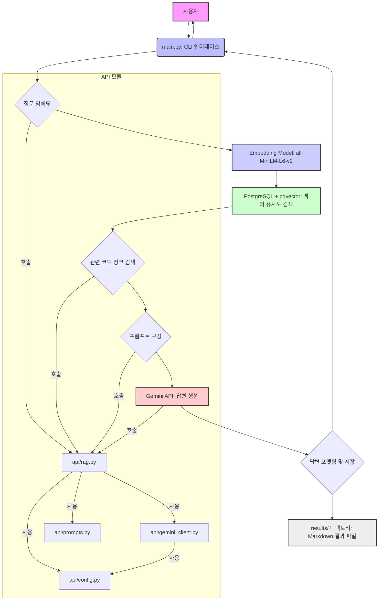
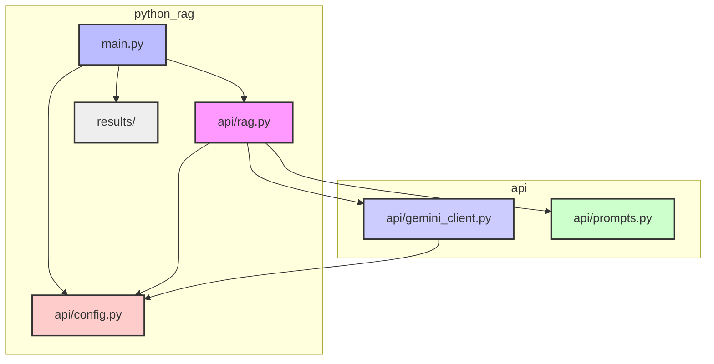
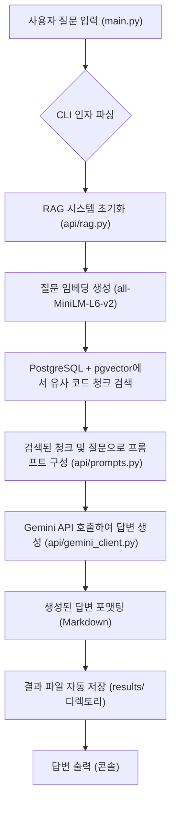

# 프로젝트 구조 및 개요

## 개요
`python_rag`는 코드베이스에 대한 질문 및 답변(Q&A) 기능을 제공하는 Python 기반의 RAG(Retrieval-Augmented Generation) 시스템입니다. 이 프로젝트는 `python_chunking` 프로젝트를 통해 미리 색인화된 코드 청크를 활용하여 작동합니다. 주요 기술 스택으로는 벡터 저장 및 유사도 검색을 위한 **PostgreSQL + pgvector**, 텍스트 생성을 위한 **Gemini API (gemini-2.0-flash-exp)**, 그리고 임베딩 생성을 위한 **all-MiniLM-L6-v2** 모델을 사용합니다. 사용자는 CLI를 통해 질문을 입력하고, 시스템은 관련 코드 컨텍스트를 검색하여 Gemini 모델을 통해 답변을 생성하며, 이 모든 과정의 결과는 자동으로 Markdown 파일로 저장됩니다.

## 프로젝트 구조

### 디렉토리 구성
`python_rag` 프로젝트는 명확한 역할 분담을 위해 다음과 같은 디렉토리 구조를 가집니다:

*   **`python_rag/`**: 프로젝트의 루트 디렉토리입니다. 모든 주요 파일과 서브 디렉토리가 여기에 포함됩니다.
*   **`api/`**: RAG 시스템의 핵심 로직과 외부 서비스(Gemini, PostgreSQL)와의 인터페이스를 담당하는 모듈들을 포함합니다. 재사용 가능한 컴포넌트들이 이 디렉토리 내에 구성되어 있습니다.
*   **`results/`**: 사용자의 질문에 대한 RAG 분석 결과가 Markdown 형식으로 자동 저장되는 디렉토리입니다.

### 주요 구성 요소
프로젝트의 핵심 기능을 담당하는 주요 모듈 및 파일은 다음과 같습니다:

*   **`main.py`**:
    *   **목적**: CLI(명령줄 인터페이스)의 진입점입니다. 사용자로부터 질문과 다양한 옵션(언어, 검색 개수, 상세 정보 등)을 입력받아 RAG 프로세스를 시작하고, 최종 결과를 출력 및 저장합니다.
    *   **역할**: 인자 파싱, RAG 클래스 초기화 및 호출, 결과 포맷팅 및 파일 저장.
*   **`api/config.py`**:
    *   **목적**: 환경 변수(`GEMINI_API_KEY`, `DB_HOST`, `EMBEDDING_MODEL` 등)를 로드하고 관리합니다.
    *   **역할**: `.env` 파일에서 설정값을 읽어와 애플리케이션 전반에서 사용될 수 있도록 제공합니다.
*   **`api/gemini_client.py`**:
    *   **목적**: Google Gemini API와의 상호작용을 담당합니다.
    *   **역할**: Gemini 모델 초기화, 프롬프트 전송, 응답 수신 등 LLM(Large Language Model) 호출 로직을 캡슐화합니다.
*   **`api/prompts.py`**:
    *   **목적**: RAG 시스템에서 Gemini 모델에 전달될 프롬프트 템플릿을 정의하고 관리합니다.
    *   **역할**: 사용자 질문, 검색된 컨텍스트, 시스템 지시사항 등을 조합하여 효과적인 프롬프트를 동적으로 생성합니다. 다국어 지원을 위한 프롬프트도 포함합니다.
*   **`api/rag.py`**:
    *   **목적**: RAG(Retrieval-Augmented Generation) 시스템의 핵심 로직을 구현합니다.
    *   **역할**: 사용자 질문 임베딩, pgvector를 이용한 유사 코드 청크 검색, 프롬프트 구성, Gemini를 통한 답변 생성 등 RAG 파이프라인의 모든 단계를 조율합니다.

### 중요한 파일
프로젝트 운영 및 개발에 필수적인 파일들은 다음과 같습니다:

*   **`requirements.txt`**:
    *   **역할**: 프로젝트가 의존하는 모든 Python 패키지 및 라이브러리를 명시합니다. `pip install -r requirements.txt` 명령으로 모든 의존성을 설치할 수 있습니다.
*   **`.env`**:
    *   **역할**: API 키, 데이터베이스 연결 정보, RAG 설정 등 민감하거나 환경에 따라 달라지는 설정값을 저장합니다. `.env.example`을 복사하여 사용합니다.
*   **`README.md`**:
    *   **역할**: 프로젝트의 개요, 기능, 설치 방법, 사용법, 아키텍처, 설정 등 전반적인 정보를 제공하는 문서입니다.
*   **`SETUP_GUIDE.md`, `USAGE.md`, `SUMMARY.md`**:
    *   **역할**: 프로젝트의 설치, 사용법, 요약 등 특정 주제에 대한 상세한 문서를 제공합니다.

## 주요 기능

### 1. RAG 기반 코드베이스 Q&A
-   **설명**: 색인화된 코드베이스에 대해 자연어 질문을 하면, 관련 코드 컨텍스트를 검색하여 질문에 대한 답변을 생성합니다.
-   **구현**: `main.py`에서 사용자 질문을 받아 `api/rag.py`의 `RAG` 클래스를 호출합니다. `RAG` 클래스는 질문을 임베딩하고, `pgvector`를 통해 유사한 코드 청크를 검색한 후, `api/prompts.py`의 템플릿을 사용하여 프롬프트를 구성하고, `api/gemini_client.py`를 통해 Gemini 모델에 전달하여 답변을 생성합니다.
-   **관련 파일**: `main.py`, `api/rag.py`, `api/gemini_client.py`, `api/prompts.py`, `api/config.py`

### 2. pgvector를 이용한 벡터 유사도 검색
-   **설명**: 사용자 질문의 임베딩과 코드 청크의 임베딩 간의 코사인 유사도를 계산하여 가장 관련성이 높은 코드 청크를 효율적으로 검색합니다.
-   **구현**: `api/rag.py` 내에서 `sentence-transformers` 라이브러리를 사용하여 질문 임베딩을 생성하고, PostgreSQL의 `pgvector` 확장 기능을 활용하여 데이터베이스에 저장된 코드 청크 임베딩과 유사도 검색을 수행합니다. `TOP_K_RESULTS` 설정에 따라 상위 N개의 결과를 가져옵니다.
-   **관련 파일**: `api/rag.py`, `api/config.py`, `requirements.txt` (psycopg2-binary, pgvector, sentence-transformers)

### 3. 다국어 지원
-   **설명**: 한국어(기본), 영어, 일본어, 중국어 등 다양한 언어로 질문하고 답변을 받을 수 있습니다.
-   **구현**: `main.py`의 `--language` 플래그를 통해 출력 언어를 지정할 수 있습니다. `api/prompts.py`는 지정된 언어에 따라 적절한 프롬프트 템플릿을 선택하여 Gemini 모델에 전달합니다.
-   **관련 파일**: `main.py`, `api/prompts.py`, `api/config.py` (DEFAULT_LANGUAGE)

### 4. 파일 및 심볼 컨텍스트 검색
-   **설명**: 답변 생성 시, 단순히 코드 내용뿐만 아니라 해당 코드가 속한 파일 경로, 시작/종료 라인, 메타데이터 등 상세한 컨텍스트 정보를 함께 제공합니다.
-   **구현**: `python_chunking`에서 생성된 `chunks` 테이블의 `path`, `start_line`, `end_line`, `metadata` 필드를 활용하여 검색된 청크의 상세 정보를 가져옵니다. `main.py`의 `--verbose` 플래그를 통해 이 정보를 출력할 수 있습니다.
-   **관련 파일**: `main.py`, `api/rag.py` (데이터베이스 쿼리 로직), `api/prompts.py` (컨텍스트 포함 프롬프트 템플릿)

### 5. Markdown 형식 응답 및 자동 저장
-   **설명**: 생성된 답변은 가독성이 높은 Markdown 형식으로 포맷팅되며, 모든 질문 결과는 타임스탬프가 포함된 파일명으로 `results/` 디렉토리에 자동으로 저장됩니다.
-   **구현**: `main.py`에서 Gemini로부터 받은 텍스트 응답을 Markdown 형식으로 처리하고, `results/rag_analysis_YYYYMMDD_HHMMSS.md`와 같은 형식의 파일명으로 저장합니다. `--output` 플래그를 통해 사용자 지정 파일명으로 저장할 수도 있습니다.
-   **관련 파일**: `main.py`

## 아키텍처 다이어그램



## 모듈 다이어그램



## 흐름 다이어그램



## 파일 구조 상세
```
├── README.md             # 프로젝트 개요, 기능, 설치, 사용법 등 전반적인 정보 제공
├── SETUP_GUIDE.md        # 프로젝트 설정 및 환경 구성에 대한 상세 가이드
├── SUMMARY.md            # 프로젝트의 핵심 요약 정보
├── USAGE.md              # 프로젝트 사용법에 대한 상세 가이드
├── api/                  # RAG 시스템의 핵심 로직 및 외부 서비스 인터페이스 모듈
│   ├── __init__.py       # Python 패키지 초기화 파일
│   ├── config.py         # 환경 변수 및 설정값 관리 (DB, API 키, RAG 파라미터 등)
│   ├── gemini_client.py  # Google Gemini API와의 통신을 담당하는 클라이언트 모듈
│   ├── prompts.py        # Gemini 모델에 전달될 프롬프트 템플릿 정의 및 관리 (다국어 지원)
│   └── rag.py            # RAG(Retrieval-Augmented Generation) 핵심 로직 구현 (임베딩, 검색, 생성 조율)
├── main.py               # CLI(명령줄 인터페이스) 진입점. 사용자 입력 처리, RAG 실행, 결과 출력 및 저장
├── requirements.txt      # 프로젝트 의존성 Python 패키지 목록
├── .env                  # 환경 변수 설정 파일 (API 키, DB 정보 등, .env.example 기반)
└── results/              # RAG 분석 결과가 Markdown 형식으로 자동 저장되는 디렉토리
    └── rag_analysis_20251016_162441.md # 예시: 특정 시점에 저장된 RAG 분석 결과 파일
```