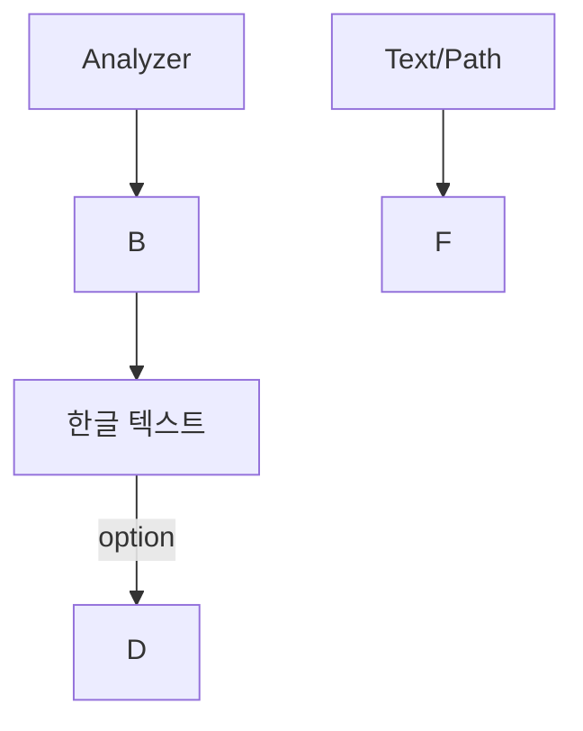

# LLM 기반 Mermaid 검증기 가이드

## 개요

python_kb 프로젝트는 이제 **LLM 기반 Mermaid 다이어그램 검증**을 사용합니다. 기존의 규칙 기반 `MermaidValidator` 대신 Google Gemini LLM을 활용하여 더 지능적이고 정확한 Mermaid 구문 검증 및 수정을 수행합니다.

## 주요 변경 사항

### 1. 새로운 모듈: `llm_mermaid_validator.py`

기존의 `mermaid_validator.py`를 대체하는 LLM 기반 검증기입니다.

**주요 기능:**
- LLM을 사용한 지능형 Mermaid 구문 분석
- 자동 오류 감지 및 수정
- 더 정확한 한글/특수문자 처리
- 주석 제거 및 화살표 구문 정규화

### 2. 업데이트된 파일들

- **`llm_mermaid_validator.py`** (신규): LLM 기반 검증 모듈
- **`gemini_client.py`**: LLM 검증기 사용하도록 수정
- **`main.py`**: LLM 검증 결과 출력 개선
- **`README.md`**: LLM 기반 검증 설명 추가

## LLM 검증의 장점

### 기존 규칙 기반 검증의 한계

```python
# 기존 방식: 정규식 기반 패턴 매칭
- 복잡한 구문 오류 감지 어려움
- 한글/특수문자 처리 불완전
- 컨텍스트 이해 부족
- 수정 품질 낮음
```

### LLM 기반 검증의 강점

```python
# LLM 방식: 자연어 이해 기반
✓ 구문 오류의 맥락적 이해
✓ 정확한 한글/특수문자 처리
✓ 의미를 보존하면서 수정
✓ 더 높은 수정 성공률
```

## 사용 방법

### 1. 자동 검증 (Wiki 생성 시)

Wiki를 생성하면 자동으로 모든 Mermaid 다이어그램이 LLM으로 검증됩니다:

```bash
# Wiki 생성 시 자동으로 LLM 검증 수행
python main.py ../python_chunking/
```

**로그 예시:**
```
INFO: LLM 기반 Mermaid 검증 시작...
INFO: Validating Mermaid block 1/3 (line 25)...
INFO: ✓ LLM이 1개의 Mermaid 블록을 수정했습니다 (총 3개 검증)
```

### 2. 수동 검증

이미 생성된 Markdown 파일의 Mermaid를 검증하고 수정:

```bash
# --validate-mermaid: 검증만 수행
python main.py ../python_chunking/ --cache-only --validate-mermaid

# --fix-mermaid: 검증 및 자동 수정
python main.py ../python_chunking/ --cache-only --fix-mermaid
```

### 3. 테스트 스크립트 실행

LLM 검증기의 동작을 테스트:

```bash
# 테스트 실행
python test_llm_validator.py
```

**출력 예시:**
```
======================================================================
LLM 기반 Mermaid 검증기 테스트
======================================================================

[테스트 1] 잘못된 Mermaid 코드 검증 및 수정
----------------------------------------------------------------------
INFO: 원본 코드:
graph TD
    A[Start] --> B  // Analysis results 
    B --> C[Process]

INFO: LLM modified Mermaid code (150 -> 120 chars)
✓ 코드가 성공적으로 수정되었습니다!
```

## LLM 검증 프롬프트

LLM은 다음 규칙으로 Mermaid를 검증합니다:

### 수정 대상 오류

1. **주석 제거**
   - `//` 주석 제거
   - `%%` 주석 제거

2. **특수 문자 처리**
   - 특수문자 포함 레이블에 따옴표 추가
   - 예: `B[Text -- here]` → `B["Text -- here"]`

3. **한글 처리**
   - 모든 한글 레이블에 따옴표 추가
   - 예: `A[한글]` → `A["한글"]`

4. **화살표 구문 정규화**
   - 잘못된 화살표 수정
   - 예: `A -- --option --> B` → `A -- "option" --> B`

5. **세미콜론 제거**
   - 불필요한 세미콜론 제거
   - 예: `A --> B;` → `A --> B`

### 예시: 수정 전/후

**수정 전:**
```mermaid
graph TD
    A[Analyzer] --> B  // Comment here
    B --> C[한글 텍스트]
    C -- --option --> D;
    E[Text/Path] --> F
```

**수정 후:**


## 구성 옵션

### LLMMermaidValidator 파라미터

```python
from llm_mermaid_validator import LLMMermaidValidator

# 기본 사용
validator = LLMMermaidValidator()

# 커스텀 설정
validator = LLMMermaidValidator(
    api_key="your-api-key",     # 커스텀 API 키
    model_name="gemini-2.0-flash-exp"  # 다른 모델 사용
)
```

### 검증 메서드

```python
# 1. 단일 Mermaid 코드 검증 및 수정
fixed_code, was_fixed, message = validator.validate_and_fix_mermaid(mermaid_code)

# 2. Markdown 전체 검증
modified_content, validated_count, fixed_count = validator.validate_markdown_content(content)

# 3. 파일 검증
from llm_mermaid_validator import validate_mermaid_in_file
was_modified, validated, fixed = validate_mermaid_in_file("file.md")
```

## 문제 해결

### Q: LLM 검증이 실패하는 경우

**A:** LLM 검증 실패 시 원본 코드가 반환됩니다. 로그를 확인하세요:

```bash
# 디버그 모드로 실행
python main.py ../python_chunking/ --verbose
```

### Q: API 키 오류

**A:** `.env` 파일에 올바른 Gemini API 키가 설정되어 있는지 확인:

```bash
# .env 파일 확인
cat .env | grep GEMINI_API_KEY
```

### Q: 너무 많은 API 호출

**A:** LLM은 각 Mermaid 블록마다 2번 호출됩니다 (검증 1회 + 수정 1회). 캐시를 사용하여 중복 생성을 방지하세요:

```bash
# 캐시 사용 (기본값)
python main.py ../python_chunking/

# 캐시만 사용 (새로 생성하지 않음)
python main.py ../python_chunking/ --cache-only --fix-mermaid
```

## 성능 고려사항

### API 호출 횟수

- Wiki 생성 시: 페이지당 1회 + Mermaid 블록당 최대 2회
- 평균적으로 4페이지 × 3블록 = 약 12-24회 API 호출

### 비용 절감 팁

1. **캐시 활용**: 이미 생성된 Wiki는 재생성하지 않음
2. **선택적 검증**: `--validate-mermaid` 플래그로 필요시에만 검증
3. **배치 처리**: 여러 프로젝트를 한 번에 처리

## 개발자 가이드

### LLM 검증 로직 커스터마이징

`llm_mermaid_validator.py`의 프롬프트를 수정하여 검증 동작을 변경할 수 있습니다:

```python
# llm_mermaid_validator.py의 validate_and_fix_mermaid 메서드에서
# prompt 변수를 수정하여 검증 규칙 조정
```

### 새로운 규칙 추가

프롬프트의 `<common_errors_to_fix>` 섹션에 새로운 규칙을 추가:

```python
<common_errors_to_fix>
1. **Comments**: Remove all comments...
2. **Node Labels**: ...
# 여기에 새로운 규칙 추가
N. **Your New Rule**: Description...
</common_errors_to_fix>
```

## 참고

- **Mermaid 공식 문서**: https://mermaid.js.org/
- **Gemini API 문서**: https://ai.google.dev/docs
- **프로젝트 위치**: `/Users/woosik/repository/deepwiki-open/python_kb/`

---

**최종 업데이트**: 2025-10-16  
**버전**: 2.0 (LLM 기반 검증)

